# Walkthru

**See where strangers get stuck.** Walkthru is the launch check for apps built with AI. AI test users try your real flows (signup, onboarding, dashboard, checkout up to payment) inside your own Chrome, think aloud, and report where they got stuck. The same report covers SEO, AI search readiness (GEO), passive security hygiene, accessibility and mobile performance, with a grounded fix prompt your coding agent can act on.

Built for solo founders, small startups and agencies shipping with Cursor, Lovable, Bolt, v0 or Claude Code.

[](LICENSE)


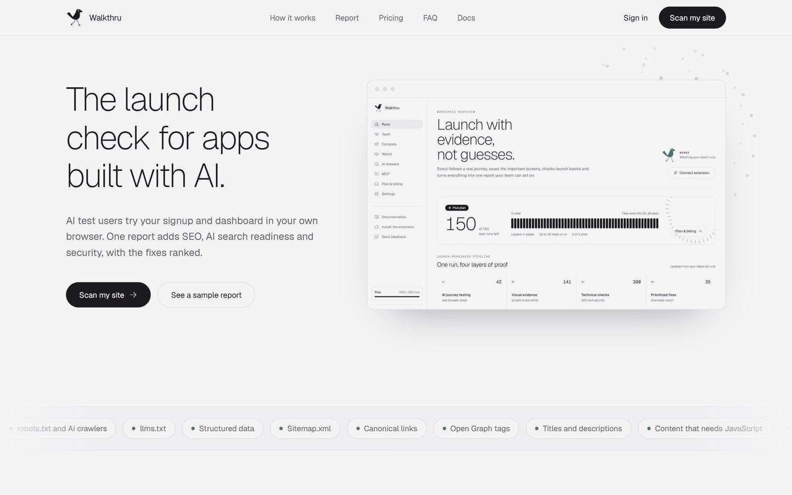

- Start here: [handoff.md](handoff.md), [AGENTS.md](AGENTS.md), [CURRENT_STATE.md](CURRENT_STATE.md)
- Product spec: [SPEC.md](SPEC.md) · Architecture: [ARCHITECTURE.md](ARCHITECTURE.md) · Design: [DESIGN.md](DESIGN.md) · Roadmap: [ROADMAP.md](ROADMAP.md)
- Deep dives: [system design](docs/system-design.md) · [agent safety plan](docs/agent-safety-plan.md) · [team collaboration](docs/team-collaboration.md) · [auth sessions](docs/auth-sessions.md) · [run idempotency](docs/run-idempotency.md) · [provider resilience](docs/provider-resilience.md) · [checkpoints](docs/checkpoints-and-request-logs.md) · [deploy](docs/deploy.md) · [billing](docs/billing.md)

---

## Contents

1. [What one report answers](#what-one-report-answers)
2. [Product tour](#product-tour)
3. [Features in depth](#features-in-depth)
4. [Architecture](#architecture)
5. [The LangGraph agent](#the-langgraph-agent)
6. [Remote MCP server](#remote-mcp-server)
7. [Team collaboration](#team-collaboration)
8. [Security hardening](#security-hardening)
9. [Privacy and data handling](#privacy-and-data-handling)
10. [Reliability engineering](#reliability-engineering)
11. [Design and brand](#design-and-brand)
12. [Repository layout](#repository-layout)
13. [Run it locally](#run-it-locally)
14. [Testing and checks](#testing-and-checks)
15. [Plans](#plans)
16. [License](#license)

---

## What one report answers

| Question | How Walkthru answers it |
|---|---|
| **Can a stranger get in?** | A persona agent (first-time visitor, phone user, buyer, skeptic, or your own custom test users on Plus) drives the page in your browser one step at a time. Logged-in pages work without sharing a password. Every finding cites a step, a screenshot or a snippet. |
| **Can Google and AI search read you?** | Deterministic SEO and GEO audits: crawlability, structured data, AI crawler access, content before JavaScript, `llms.txt`, plus a copy-paste fix pack (robots rules, JSON-LD, rendering fix for your framework). |
| **Are you leaking anything?** | Passive checks only: headers and CSP quality, cookies, TLS and CAA, exposed files and source maps, keys shipped to the browser, vulnerable CDN libraries, subdomain takeover, and bounded read-only Supabase and Firebase probes on owner-verified domains. Never an attack. |

On top of the report: a **Launch Ready score** with a live badge, automatic **rerun comparison** (fixed, still broken, new), **competitor side by side**, **weekly watch** with deploy hooks, **AI citation tracking** on free engines, **team workspaces** with a findings board and an in-chat assistant, and a remote **MCP server** so Claude Code and Cursor can scan, read fixes, open pull requests and rerun from the editor.

---

## Product tour

Screens below are real captures of the web app (headless Edge at 1.5x, reduced motion) and real public reports from the local fixture sites. The design mockups are in [Design and brand](#design-and-brand).

### How it works

Paste an address for a free Instant Scan, give a test user a goal, watch it drive your real tab, then fix and rerun.


### The evidence report

Every stuck point has a step, the test user's own words and a screenshot. One Launch Ready score, weighted only by what was actually measured.

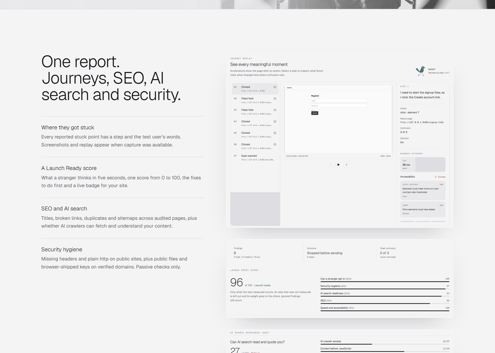

| Evidence report (real run) | Extension side panel |
|---|---|
|  |  |
| **Security hygiene (real run)** | **SEO and AI search readiness (real run)** |
|  |  |

Where a test user got stuck, with the exact step and evidence:


### Dashboard

The signed-in workspace: runs, team, compare, watch, AI answers, MCP, plan and billing.

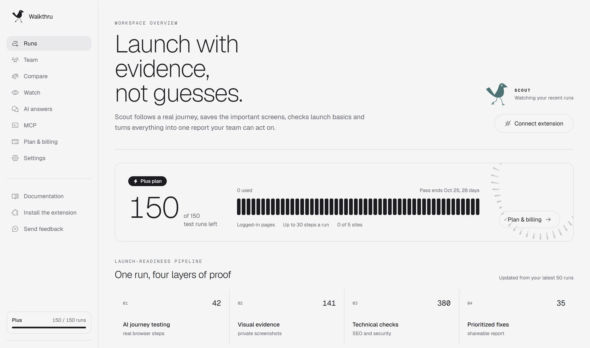

### Logged-in pages without your password


### Plans, docs and the trust pages

| Pricing | Every plan, line by line |
|---|---|
| 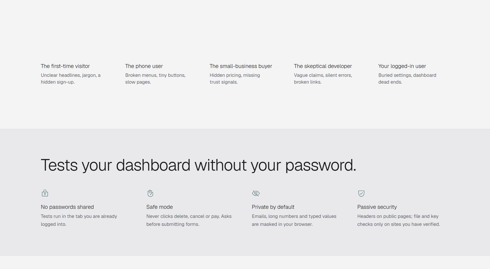 | 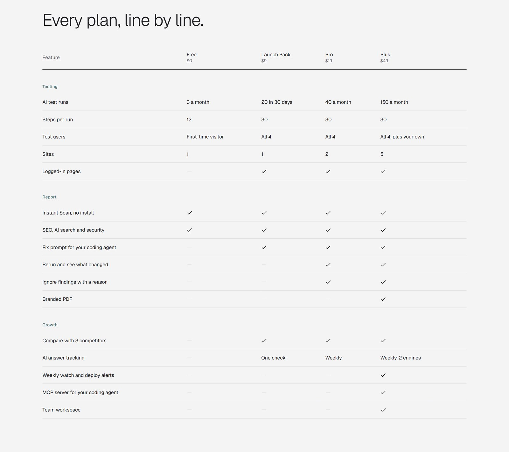 |
| **Docs: connect your editor (MCP)** | **Docs: team workspaces** |
| 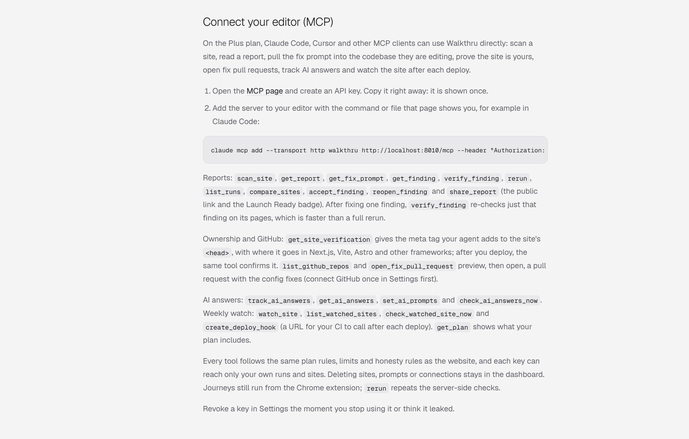 | 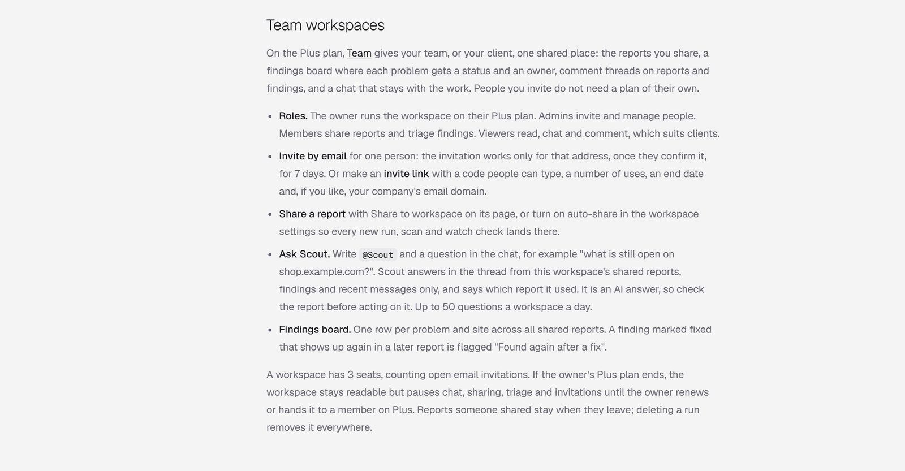 |
| **Security page: where test users may act** | **Sign in (Google, GitHub, magic link)** |
| 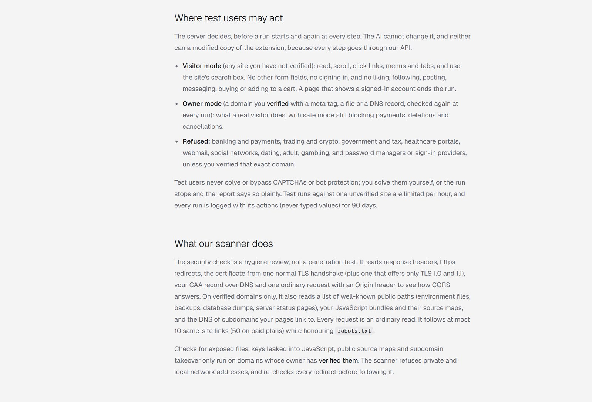 |  |

### Scout

Scout, the walking bird, is the mark, the in-product assistant and the test user you watch in the side panel. The Agent Lab page (`/agent-lab`) is the identity playground.

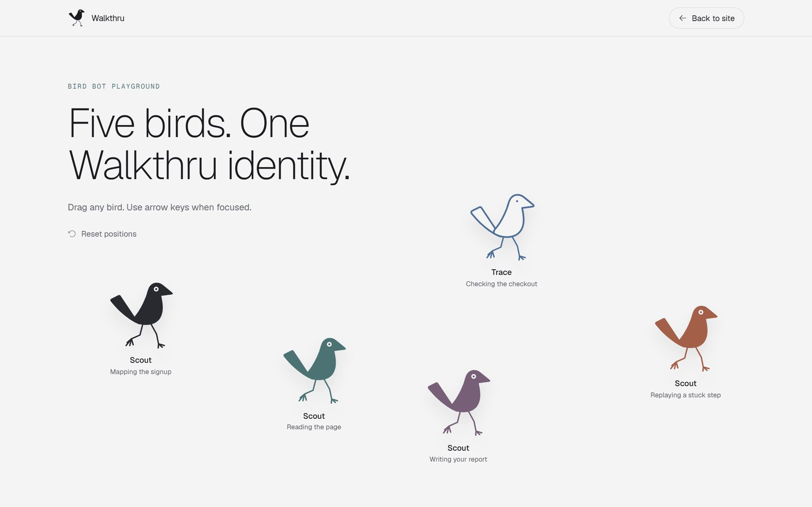

---

## Features in depth

### 1. AI test users (persona journeys)

- **Built-in personas.** `first_timer` (skims, impatient), `phone_user` (taps big obvious things, hates long forms), `buyer` (pricing, trust, what happens next), `skeptic` (reads errors, checks links, distrusts vague copy). Defined in [`app/agent/persona.py`](apps/api/app/agent/persona.py).
- **Custom test users (Plus).** Up to 10 saved test users written in your own words, and up to 6 journeys on the same page in one test set (`app/plus.py`), so one report compares how different people fail.
- **Goal planner.** One model call turns the owner's typed goal into 1 to 4 ordered checkpoints, fixes typos, reads intent instead of literal words, and refuses goals that pay, delete, spam, attack or target another site. Code ends the run as soon as the last checkpoint is reached, so "click next project" stops after one click instead of circling.
- **Think aloud.** Every step records the persona's thought, the action, the target element's label (never the typed value), a confusion score 0 to 3, and what the step led to (`result_url`, visible errors, confirmations, "nothing visible changed").
- **Test identity.** Forms get a deterministic throwaway identity (`walkthru.tester+<run>@example.com`), never your data.
- **Evidence.** Up to 8 masked JPEG screenshots per run, captured on the first step, on confusion, on errors and on clicks and typing, uploaded straight to private Storage under the user's own JWT.
- **Logged-in pages.** The test runs in your real tab with your existing session. No password is shared and cookies never leave the browser. Logged-in testing requires a verified domain.
- **Human take-over.** CAPTCHAs and bot walls are never solved. You solve them yourself and press Continue, or the run stops and the report says it was the site's bot protection, not a usability problem.

### 2. Launch checks (deterministic, no model)

| Area | Module | What it measures |
|---|---|---|
| Crawl | `scans/site.py` | One bounded same-site crawl (10 pages free, 50 paid), robots.txt honoured, shared by SEO, GEO and security |
| SEO | `seo.py`, `seo_depth.py` | Titles, descriptions, canonicals, duplicates, broken links, sitemaps, Open Graph, structured data |
| AI search (GEO) | `geo.py`, `geo_depth.py`, `geo_fixes.py` | AI crawler access in robots.txt, content present before JavaScript, `llms.txt`, schema, citability, plus a generated fix pack per framework |
| Security hygiene | `security.py`, `csp.py`, `tls.py` | Headers and CSP quality, cookies, https redirects, TLS versions from one normal handshake plus one legacy offer, CAA over DNS, CORS answer to one Origin request |
| Leaks (verified only) | `secrets.py`, `libraries.py`, `takeover.py`, `backend.py` | Keys shipped in JS bundles (gitleaks rules), public source maps, exposed well-known files, vulnerable CDN libraries (retire.js data), dangling subdomains, bounded read-only Supabase and Firebase probes |
| Email | `email.py` | SPF, DKIM selectors, DMARC policy |
| Accessibility | `accessibility.py` + extension | axe-core WCAG A/AA in the real tab, server basics for Instant Scans |
| Performance | `performance.py` + extension | PageSpeed Insights (mobile) plus Core Web Vitals from the tab |
| Stack | `stack.py` | Framework and backend fingerprint, so fixes match your framework |

### 3. Launch Ready score and Agent Ready

Plain code over the stored report ([`app/agent/score.py`](apps/api/app/agent/score.py)), never a model:

```
weights:   ux 30 · security 20 · geo 20 · seo 15 · speed 15
penalty:   high 25 · medium 10 · low 3   (per finding, floored at 0)
journey:   done, safe_stop = 100 · gave_up, stuck, budget = 50 · Walkthru's own stops = not measured
```

An area that was not measured is left out and its weight goes to the others; it is never scored 0. Ignored findings still count toward the score, so the public badge cannot be gamed by hiding problems. `agent_ready` separately answers whether an AI agent can use the site.

### 4. Rerun compare and finding fingerprints

Each finding has a stable fingerprint `kind:rule` (legacy reports fall back to a normalised title key with digits folded). A rerun of the same goal on the same site marks every finding **fixed**, **still broken** or **new**. `accept_finding` records a deliberate won't-fix with a reason; it leaves the lists but still counts in the score. `verify_finding` re-checks just one finding on its pages, faster than a full rerun.

### 5. Fix prompts and fix pull requests

- **Fix prompt** ([`fix_prompt.py`](apps/api/app/agent/fix_prompt.py)): one Markdown prompt for Cursor, Claude Code, Codex, Lovable or Bolt, built in code from the stored report and `recipes.json` with no model call, so it can only contain what the report found. Each finding gets why it matters, the change for the detected stack (`vercel.json`, `netlify.toml`, `next.config.js`, `public/_headers`), the risk and a local check, in batches that each end with "stop and verify". Things outside the code (DNS, hosting, email, provider dashboards) are listed separately; ignored findings are left out and secret values are masked.
- **Fix pull requests** ([`app/github.py`](apps/api/app/github.py)): the Walkthru GitHub App is installed on the repositories you choose. Only the installation id is stored. Connecting proves ownership with the user-to-server OAuth code from the same redirect, then revokes that token at once. Each PR uses a token minted for one action and one repository. Changes come only from deterministic recipes (security headers in `vercel.json`, `netlify.toml` or `public/_headers`, new `llms.txt` or `ai.txt`); files are created or appended, never rewritten; secrets and application code are never touched. Walkthru never merges.

### 6. Competitor side by side

Compare your site with up to three competitors on the same server-side checks, as a durable background job ([`compare.py`](apps/api/app/agent/compare.py)).

### 7. AI citation tracking

[`app/citations.py`](apps/api/app/citations.py) asks AI engines your prompts and measures in code whether the answer names your site, cites it, and your share of voice against named competitors. Engines on free quotas: Groq `gpt-oss-120b` with its built-in browser search (web citations matched to answer references), and Gemini without search (memory: mentions only, labelled as such). Nothing promises rankings; it reports what the engines said on the day. Data model adapted from `ai-search-guru/getcito` (MIT).

### 8. Weekly watch and deploy hooks

Watched sites are re-scanned weekly and on a deploy hook URL your CI calls (at most one check every 10 minutes). The owner is emailed only when findings change. Hook URLs are shown once and stored as SHA-256.

### 9. Team workspaces and remote MCP

See [Team collaboration](#team-collaboration) and [Remote MCP server](#remote-mcp-server).

### 10. Billing

Founder-approved 30-day passes through Dodo Payments with signed webhooks, payable without a credit card ([docs/billing.md](docs/billing.md)). The server owns entitlements: the client never says which plan it is on.

---

## Architecture

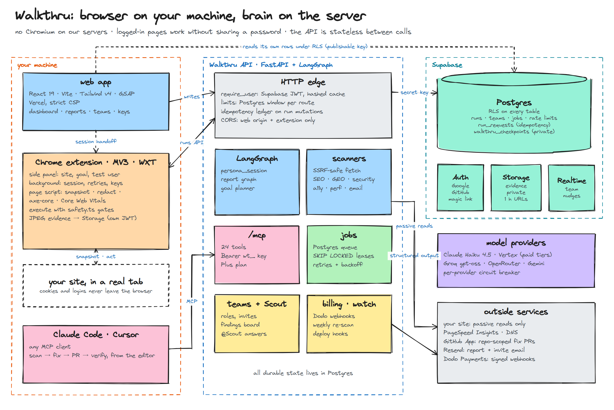

### Key design decisions

1. **Browser on the user's machine, brain on the server.** No Chromium on our servers, so hosting stays near zero and logged-in pages work without sharing passwords.
2. **One HTTP call per agent step.** LangGraph `interrupt()` emits the next action and `Command(resume=observation)` continues. A Postgres checkpointer holds state, so the API is stateless between calls and can scale out. Start, observe and stop accept an `Idempotency-Key`.
3. **Deterministic code before a model call.** Accessibility, performance, SEO, GEO and security are plain code. Models explain and prioritise evidence; only the persona session is an agent. Scores, comparisons and fix prompts are computed in code and cannot invent findings.
4. **Prompts are never a safety boundary.** Every rule about where the agent may act is code that runs on the server before the run and again at every step, so neither the model nor a modified extension can talk its way past it.
5. **Free tier models first.** Groq `gpt-oss-120b`, then OpenRouter and Gemini fallbacks, with a shared circuit breaker. Paid tiers put Claude Haiku 4.5 on Vertex AI in front when configured, with the free chain behind it. Every report states which model wrote it.
6. **The server owns the plan.** `POST /runs` clamps steps, sites, test users and logged-in access from the caller's entitlement.
7. **Reads through RLS, writes through the API.** The web app reads its own rows straight from Supabase under row-level security; every write and business rule goes through FastAPI.

### Components

| Part | What it does | Where |
|---|---|---|
| **Web app** | Landing, pricing, docs, login (Google, GitHub, magic link), dashboard, private and public reports, compare, watch, AI answers, teams, settings with API keys, billing | `apps/web` (React 19, Vite, TypeScript, Tailwind v4, GSAP) |
| **Chrome extension** | Side panel to start a run, page script that snapshots the DOM (open shadow roots included), masks PII, runs axe WCAG A/AA and Core Web Vitals, executes actions with safety gates, and captures up to eight masked screenshots | `apps/extension` (Chrome MV3, WXT, React) |
| **API** | Run lifecycle, persona graph, report graph, scans, entitlements, billing webhooks, teams, watch, citations, MCP | `apps/api/app` (Python 3.12, FastAPI, LangGraph, httpx) |
| **Persona agent** | LangGraph graph with step budgets, loop guards, safe stops on Pay and Delete, optional TypeSafe Jev provider for bounded decisions | `apps/api/app/agent/` |
| **Scanners** | `site`, `seo`, `seo_depth`, `geo`, `geo_depth`, `geo_fixes`, `security`, `csp`, `tls`, `secrets`, `libraries`, `takeover`, `backend`, `email`, `accessibility`, `performance`, `stack`, `agent_signals` | `apps/api/app/scans/` |
| **SSRF-safe fetcher** | Resolves each host once, refuses private and metadata addresses (including IPv4 hidden in IPv6), pins the connection to the checked address, re-checks every redirect, and allows at most two concurrent requests per host | `app/scans/fetch.py` |
| **Background jobs** | Durable Postgres queue: `claim_job` with `FOR UPDATE SKIP LOCKED`, 15-minute leases, per-kind attempts, exponential backoff with jitter, periodic retention and watch scheduling. Survives restarts and runs across processes | `app/jobs.py` |
| **Rate limits and abuse** | Shared Postgres limiter per address, account, route and MCP key; per-target journey caps, kill switches, run audit log and automatic suspension | `app/limits.py`, `app/abuse.py` |
| **Migrations** | Numbered SQL files, each applied in one transaction with a checksum; editing an applied file is refused | `app/migrate.py`, `apps/api/migrations/` |
| **MCP server** | Remote MCP at `/mcp` (streamable HTTP, personal API key, Plus plan) with 24 tools | `app/mcp_server.py` |
| **Citations** | AI answer tracking with evidence, on a dedicated queue | `app/citations.py`, `app/citation_evidence.py` |
| **Teams** | Workspaces with roles, invitations, shared reports, findings board, threads, activity and Scout in team chat | `app/teams.py`, `app/scout.py` |
| **Billing** | Founder-approved 30-day passes through Dodo Payments with signed webhooks | `app/billing.py` |
| **Admin panel** | Founder-only panel on `127.0.0.1:8020` with password and authenticator code. Never deployed | `apps/api/admin/` |
| **Data** | Supabase Postgres with RLS on every table, private `run-evidence` Storage bucket, LangGraph checkpoints in a private schema | `apps/api/migrations/` |
| **Email** | Resend over REST (report ready, watch changes, team invites) | `app/deliver.py` |
| **Evals and fixtures** | Easy, hard and showcase fixture sites full of traps; LangSmith evals; a headless end-to-end driver for the built extension | `evals/` |

---

## The LangGraph agent

Two graphs do the work. `persona_session` is the only true agent: a loop that drives your browser one step per HTTP call. The report graph is a fan-out of deterministic scans with two model calls at the edges.

### `persona_session`: decide, act, check

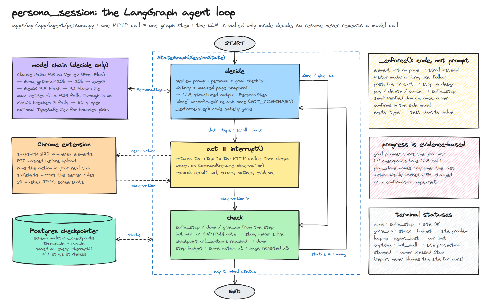

The wiring, exactly as compiled in [`persona.py`](apps/api/app/agent/persona.py):

```python
g = StateGraph(SessionState)
g.add_node("decide", decide)   # the only node that calls a model
g.add_node("act", act)         # interrupt(): hands the step to the HTTP caller, resumes with the observation
g.add_node("check", check)     # pure code: stop rules
g.add_edge(START, "decide")
g.add_conditional_edges("decide", after_decide)  # done / give_up -> check, anything else -> act
g.add_edge("act", "check")
g.add_conditional_edges("check", after_check)    # running -> decide, else END
graph = g.compile(checkpointer=checkpointer)     # thread_id = run_id
```

**State** (`SessionState`): run id, site, goal, persona or custom persona prompt, `verified`, `mode` (owner or visitor, decided by the server), `max_steps`, the latest `observation`, the `steps` log, `status`, `tokens`, the goal `plan` and `plan_done`.

**`decide`** renders the persona, the goal checklist (with done and current markers), the step history (including where each step led) and a text snapshot of the page: numbered interactive elements with `[filled]` or `[empty]` field states, visible errors and confirmations, scroll position and up to 4,000 characters of page text. The model returns a `PersonaStep` through structured output. Then three code checks run before anything leaves the server:

1. **Unconfirmed done.** If the model says "done" right after a click or typing that changed nothing, it is asked once more (`NOT_CONFIRMED`). If it insists, the step becomes `give_up` with an honest note. A real run once declared a signup complete without submitting it; this is the fix.
2. **Evidence-based progress.** `plan_done` only moves forward when the last action visibly worked (the URL changed or a confirmation appeared). When every checkpoint is complete, the run ends even if the model wants to keep going.
3. **`_enforce()`**, the code safety gate, replaces unsafe or invalid choices instead of trusting the prompt:

| Model chose | `_enforce()` does |
|---|---|
| An element id that is not on the page | Scroll instead, confusion raised (counted toward `agent_lost`) |
| Typing into a non-search field on an unverified site | Stop by design (`visitor_mode_limit`): "everything up to here worked" |
| Like, follow, share, post, buy, add to cart on an unverified site | Stop by design (`visitor_mode_limit`) |
| Pay, delete, cancel, checkout, transfer | `safe_stop` (logged-in runs: blocked and given up) |
| Send or invite on an unverified site | `safe_stop` |
| A second send in the same run | Done: Walkthru never sends twice |
| `type` with empty text | Fills the test identity value for that field |

**`act`** calls `interrupt(step)`. The HTTP request returns that step to the extension and the thread sleeps in the checkpointer. The next `POST /runs/{id}/observe` resumes it with `Command(resume={observation, evidence})`. Because the model runs only in `decide`, a resume never repeats a model call.

**`check`** is pure code. It ends the run on `safe_stop`, `done` or `give_up` (`agent_lost` when the last three actions picked missing elements), on a bot wall or CAPTCHA note, when the current URL satisfies the next checkpoint's `url_contains`, on the step budget (12 on Free, 30 on paid plans), on the same action three times in a row (`stuck`), or on arriving at the same page for the third time (`looping`). The report wording comes from one table of stop reasons, so Walkthru never blames the site for its own limits.

**Model chain for `decide`** ([`runtime.py`](apps/api/app/agent/runtime.py)): Claude Haiku 4.5 on Vertex AI first on Pro and Plus when configured, then Groq `gpt-oss-120b`, `gpt-oss-20b` and `qwen3`, then Gemini 3.5 Flash and 3.1 Flash-Lite. `max_retries=0` everywhere so a 429 falls through in milliseconds instead of sleeping on `retry-after`; `reasoning_effort=low` keeps gpt-oss from long reasoning spirals. With `PERSONA_DECISION_MODEL=jev`, a TypeSafe Jev classifier picks from the observed elements for bounded decisions and abstains to the LLM chain when unsure.

**Checkpointer.** `CHECKPOINTER=memory` in development; production refuses to start without `CHECKPOINTER=postgres`. The `PostgresSaver` lives in a private `walkthru_checkpoints` schema that is never exposed through the REST API, uses a bounded pool (4 connections, statement and lock timeouts, keepalives, health checks), refuses the Supabase transaction pooler, and verifies at startup that the numbered migration matches the pinned library's schema version.

### One step, end to end

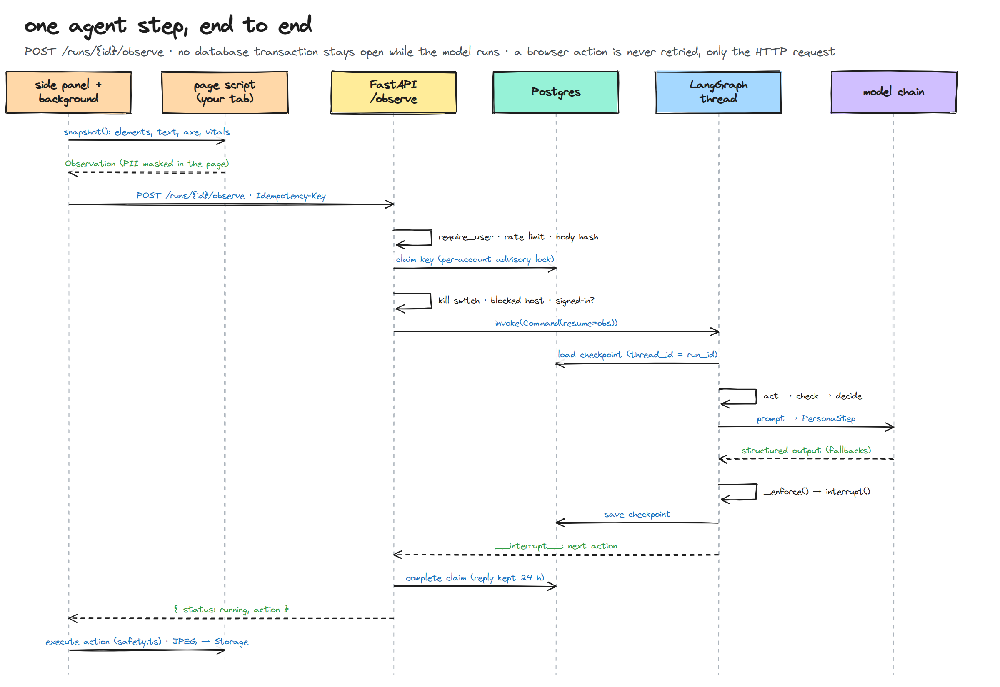

`POST /runs/{id}/observe` passes through, in order: Supabase JWT validation (cached by SHA-256 of the token for at most 300 seconds, never past expiry), the per-run `observe` rate limit (60 a minute), the idempotency claim, kill switches, the blocked-host check on the tab's current URL, the signed-in-but-unverified check, and only then `graph.invoke(Command(resume=...))`. No database transaction stays open while the model runs.

### The report graph

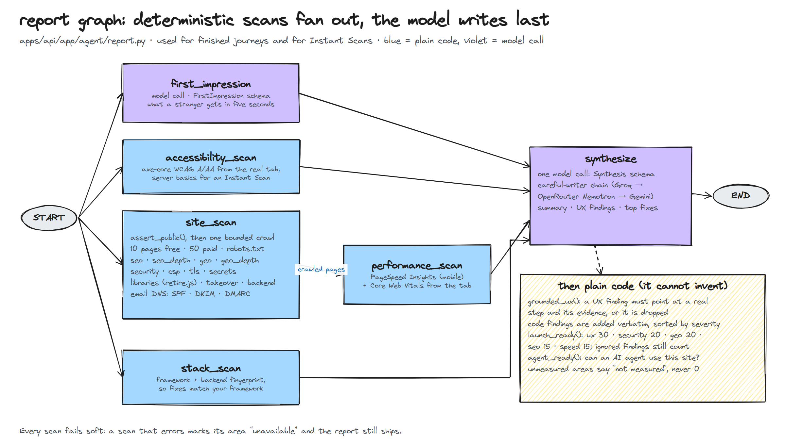

```python
for n in ("first_impression", "accessibility_scan", "site_scan", "stack_scan"):
    g.add_edge(START, n)                       # fan out in parallel
g.add_edge("site_scan", "performance_scan")    # performance waits for the crawled pages
g.add_edge(["first_impression", "accessibility_scan", "performance_scan", "stack_scan"], "synthesize")
g.add_edge("synthesize", END)
```

Only `first_impression` and `synthesize` call a model. `synthesize` uses the careful-writer chain (Groq, then OpenRouter Nemotron, then the rest). After it, code takes over: `grounded_ux()` drops any UX finding that does not point at a real step and its evidence, code findings are added verbatim, `plain()` strips markdown and em dashes, and the Launch Ready and Agent Ready scores are computed. A scan that errors marks its area "unavailable" and the report still ships.

---

## Remote MCP server

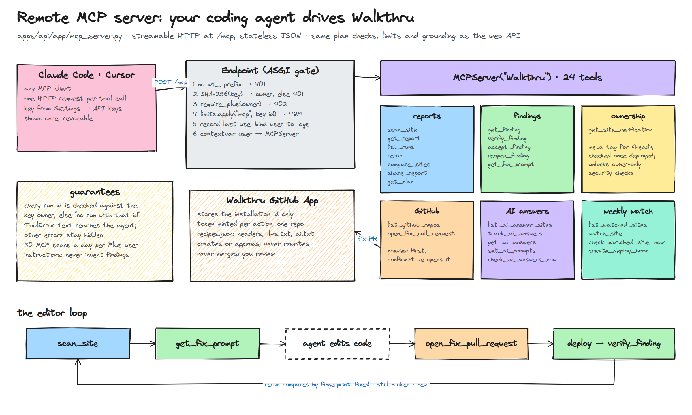

[`app/mcp_server.py`](apps/api/app/mcp_server.py) mounts a remote MCP server at `/mcp` on the same FastAPI app: streamable HTTP, `stateless_http=True`, `json_response=True`, one request per tool call.

**Auth gate (ASGI `Endpoint`)**, before the MCP session manager sees the request:

1. `Authorization: Bearer wt_...` or 401. Keys are `wt_` + 32 bytes of `secrets.token_urlsafe`, shown once, at most 5 per account.
2. The key's SHA-256 is looked up; the raw key is never stored. Unknown or revoked: 401.
3. `require_plus(owner)`: the server reads the plan; anything but Plus is 402.
4. `limits.apply("mcp", key_id)`: 60 calls a minute per key, in Postgres, so it holds across processes. MCP scans have their own cap of 50 a day per Plus user and never use the free capacity.
5. Last use is recorded and the user is bound to the request's log context.
6. The user id is set in a `contextvar` for the duration of the request; every tool reads it, and every run id is checked against it (`"No run with that id in your account"`).

Only `ToolError` messages reach the agent; other exceptions stay hidden. The server instructions tell the agent that findings are grounded in evidence and must never be invented.

**The 24 tools**

| Group | Tools |
|---|---|
| Reports | `scan_site`, `get_report`, `list_runs`, `rerun`, `compare_sites`, `share_report` (public link + Launch Ready badge), `get_plan` |
| Findings | `get_finding`, `verify_finding`, `accept_finding`, `reopen_finding`, `get_fix_prompt` |
| Ownership | `get_site_verification` (meta tag for your `<head>` with framework-specific placement, then confirms it once deployed) |
| GitHub | `list_github_repos`, `open_fix_pull_request` (preview first, `confirm=true` opens it) |
| AI answers | `list_ai_answer_sites`, `track_ai_answers`, `get_ai_answers`, `set_ai_prompts`, `check_ai_answers_now` |
| Weekly watch | `list_watched_sites`, `watch_site`, `check_watched_site_now`, `create_deploy_hook` |

User journeys still run only from the Chrome extension; `rerun` repeats the server-side checks. Connect from Claude Code:

```bash
claude mcp add --transport http walkthru http://localhost:8010/mcp --header "Authorization: Bearer YOUR_KEY"
```

Cursor and other clients take the same URL and header.

---

## Team collaboration

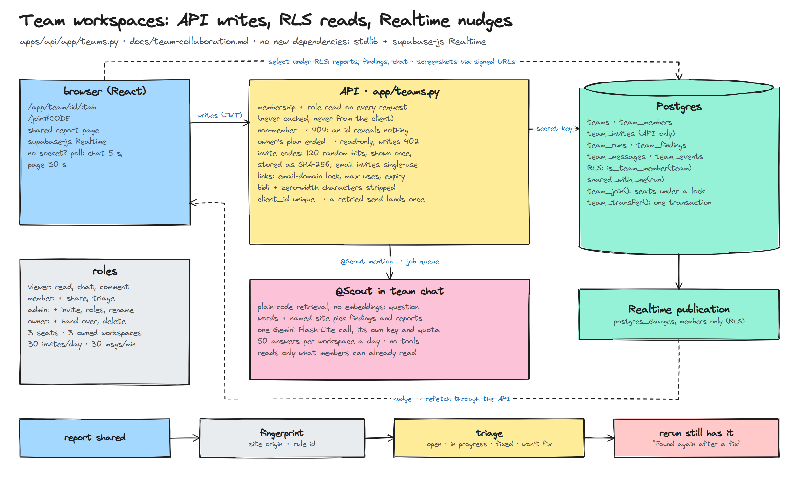

A Plus owner creates a **workspace** for their team or a client: shared reports (manual or auto-share), a **findings board** with one row per problem and site (open, in progress, fixed, won't fix, with an owner), a persistent **chat** with @mentions and unread counts, **comment threads** on every report and finding, an **activity log** that doubles as the audit trail, and **presence**. Members do not need a plan of their own. Full reference: [docs/team-collaboration.md](docs/team-collaboration.md).

**How it is built**

- **All writes and business rules go through the API.** Membership and role are read from the database on every request, never cached and never taken from the client. A non-member gets **404**, so a workspace id reveals nothing.
- **Row-level security is the second wall.** Browsers get `select` only, on rows of workspaces they belong to, through `SECURITY DEFINER` functions `is_team_member(team)` and `shared_with_me(run)` that answer only for `auth.uid()`. Invitations are never readable from a browser. No team table grants insert, update or delete to a browser role.
- **Shared reports reuse the existing report view.** Policies on `runs` and `storage.objects` let a member read a shared run and its screenshots straight from Supabase.
- **Realtime is a nudge, not a data path.** A `postgres_changes` event (members only, under RLS) makes the page refetch through the API. Without a socket, chat polls every 5 seconds and pages every 30.
- **Concurrency.** Seats are counted inside one locked transaction (`public.team_join`), so two people can never take the last seat. Ownership moves in one transaction (`public.team_transfer`). `(team_id, client_id)` is unique on messages, so a retried send lands once.
- **Invitations.** Codes carry 120 random bits, are shown once and stored as SHA-256. Email invites are single use and only work for the verified address they were sent to. Invite links can be limited to an email domain, a number of uses and an end date, and never grant admin.
- **Input hygiene.** Control characters and bidirectional overrides are stripped from names and messages so they cannot disguise text. Invitee emails are masked in the activity feed because viewers read it.
- **Plan lapse.** If the owner's Plus plan ends, the workspace becomes read-only (402 on chat, shares, triage and invites) until they renew or hand it to a member on Plus. Leaving, removing people and deleting always work.
- **"Found again after a fix."** Findings are keyed by site origin plus the stable fingerprint, so a finding marked fixed that reappears in a later shared report is flagged.

| Action | Viewer | Member | Admin | Owner |
|---|---|---|---|---|
| Read reports, findings, chat, activity | yes | yes | yes | yes |
| Chat and comment | yes | yes | yes | yes |
| Share own reports, triage findings | no | yes | yes | yes |
| Invite, change roles, remove people, rename | no | no | yes | yes |
| Hand over, delete the workspace | no | no | no | yes |

Limits: 3 seats per workspace, 3 owned workspaces, 20 memberships, 5 open invite links, 30 invitations a day, 30 messages a minute.

**Scout in team chat.** `@Scout <question>` answers from the workspace's shared reports, findings board and recent chat ([`app/scout.py`](apps/api/app/scout.py)). Retrieval is plain code with no embeddings: the question's words and any site it names pick the findings and reports that go into one prompt (14,000 characters at most). One Gemini Flash-Lite call on its own key and quota, so chat never starves the journey models; 50 answers per workspace per UTC day, 45-second budget. Scout reads only what the members can already read, takes no actions and has no tools.

---

## Security hardening

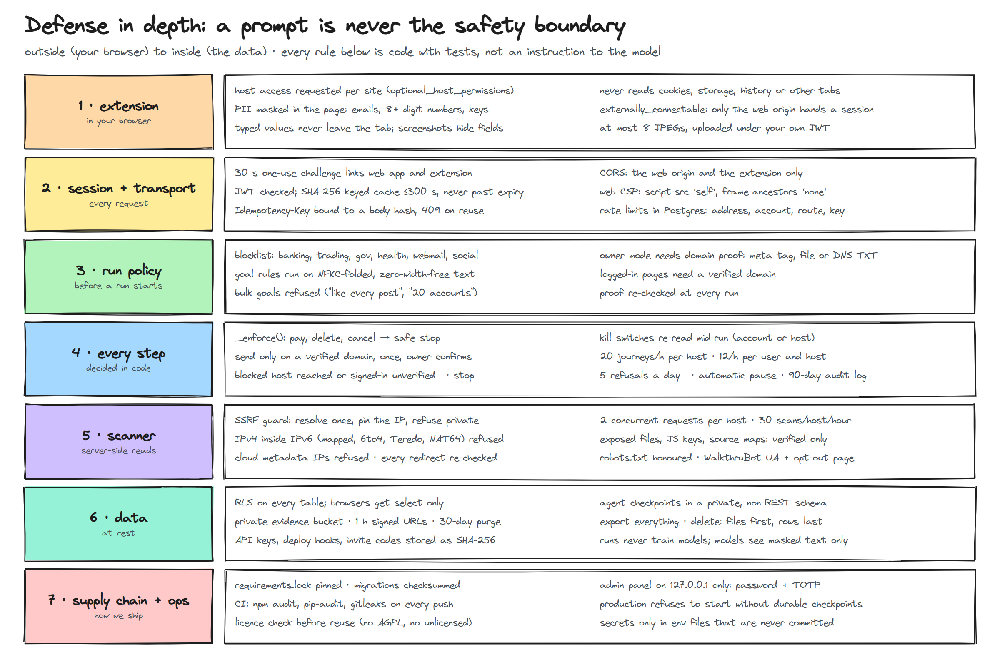

Written after a test run where the agent was told to like five posts on Instagram with the founder's logged-in account. The full threat model and launch gates are in [docs/agent-safety-plan.md](docs/agent-safety-plan.md).

### Where the agent may act ([`policy.py`](apps/api/app/agent/policy.py))

Decided by the server before a run starts and again at every step. The model cannot change it, and neither can a modified extension, because every step goes through the API.

| Mode | When | What the test user may do |
|---|---|---|
| **Visitor** | Any site you have not verified (default) | Read, scroll, click links, menus and tabs, use the site search. No other form fields, no signing in, no social or commerce actions. A page showing a signed-in account ends the run. |
| **Owner** | A domain you proved with `<meta name="walkthru-verification">`, `/.well-known/walkthru.txt` or a `_walkthru.<host>` DNS TXT record, re-checked at every run and never cached | Everything a real visitor does; safe mode still blocks payments, deletions and cancellations, and a real send needs your confirmation in the side panel |
| **Refused** | Banking, payments, trading, crypto, government, tax, healthcare portals, webmail, social networks, dating, adult, gambling, password managers and sign-in providers (`blocklist.json`) | Nothing, unless you verified that exact domain |

The verification token is an HMAC of the account id, so it proves one account controls the domain. Goal rules run before the planner's model call, on text that is NFKC-normalised with zero-width characters removed (so `l​ike` or full-width letters read as plain words): social and commerce verbs are owner-only, and bulk goals ("like every post", "create 20 accounts", "dozens of messages") are refused everywhere. The planner's own refusal is a second layer, not the first.

**Abuse controls** ([`app/abuse.py`](apps/api/app/abuse.py)), all counted in Postgres so they hold across processes: 20 journeys an hour against one unverified host across all users, 12 an hour per user and host, account and host kill switches re-read mid-run, an automatic pause after 5 refused goals or sites in a day, and a per-run audit log of actions (never typed values) kept for 90 days.

### The extension reads as little as possible

- Host access is requested per site when a test starts (`optional_host_permissions`), never granted up front. Permissions: `activeTab`, `sidePanel`, `scripting`, `tabs`, `storage`.
- PII is masked inside the page before upload ([`lib/redact.ts`](apps/extension/lib/redact.ts)): emails, any 8+ digit number (cards, phones, account numbers, IBAN tails) and key-like strings (`sk_`, `pk_`, `ghp_`, `xox*`, `AKIA...`). Typed values never leave the tab; screenshots hide form fields.
- It never reads cookies, local or session storage, saved passwords, history, other tabs or network requests. An automated test fails the build if its code ever touches those.
- `externally_connectable` allows only the web origin to hand it a session. The handoff is a 30-second one-use challenge bound to the user and Auth session; both Chrome's sender origin and URL origin must match; the background worker serialises credential changes so a late refresh can never restore a signed-out session ([docs/auth-sessions.md](docs/auth-sessions.md)).
- `safety.ts` mirrors the server's social and commerce verb lists so the side panel stops early, but the server is the authority.

### The scanner cannot be turned into an SSRF

[`app/scans/fetch.py`](apps/api/app/scans/fetch.py) resolves each host once, requires every resolved address to be globally routable, and pins the connection to the checked address (no DNS rebinding window):

```python
def is_public_ip(address: str) -> bool:
    ip = ipaddress.ip_address(address.split("%", 1)[0])  # drop an IPv6 zone id
    if ip in METADATA or ip.is_multicast:                 # 169.254.169.254, fd00:ec2::254, 100.100.100.200, ...
        return False
    if ip.version == 6:                                   # IPv4 hidden in IPv6 must be public too
        inner = ip.ipv4_mapped or ip.sixtofour or (ip.teredo[1] if ip.teredo else None)
        if ip in NAT64:
            inner = ipaddress.IPv4Address(int(ip) & 0xFFFFFFFF)
        if inner is not None and not is_public_ip(str(inner)):
            return False
    return ip.is_global
```

Every redirect (at most 5) is re-checked before it is followed. Bodies are capped at 300 KB, timeouts are short, at most two concurrent requests go to one host and at most 30 scans an hour to one target. The scanner identifies itself as `WalkthruBot` with a page that explains how to opt out. Every request is an ordinary read: no attack payloads, no fuzzing, no writes. Exposed files, keys in JavaScript, source maps and subdomain takeover checks run only on verified domains.

### Sessions, requests and keys

- **Auth.** Supabase validates every bearer token; the API caches a validated token by its SHA-256 for at most 300 seconds and never past its own expiry, and refuses a known-expired token before consulting the cache.
- **Idempotency** ([docs/run-idempotency.md](docs/run-idempotency.md)). `POST /runs`, `/observe` and `/stop` take an `Idempotency-Key`. Claims are durable, unique per user and key, and bind the operation plus a canonical body hash: a different body for the same key is 409, an in-flight duplicate is 409 with `Retry-After`, and a completed claim replays its original response for 24 hours. There is no timeout-based takeover, so an operation with an unknown outcome is never silently repeated. The extension retries only the HTTP request carrying an already captured observation, never a browser action.
- **Rate limits** ([`app/limits.py`](apps/api/app/limits.py)): one Postgres fixed window per key. Public 120/min per address, account 240/min, auth 60/min, start run 10/min, observe 60/min per run, costly routes 10/min, MCP 60/min per key. `/health` is exempt. The limiter fails open if the database is unreachable so an outage does not become a lockout.
- **Secrets at rest.** MCP keys, deploy hooks and invite codes are stored only as SHA-256 fingerprints and shown once. GitHub tokens are minted per action and never stored.
- **Web app headers.** `Content-Security-Policy: default-src 'self'; script-src 'self'; frame-ancestors 'none'; base-uri 'self'; form-action 'self'; object-src 'none'`, plus `nosniff`, a strict referrer policy and a `Permissions-Policy` that turns off camera, microphone and geolocation. CORS is locked to the web origin and the extension.
- **Admin.** The founder panel binds to `127.0.0.1:8020` only, with a password hash and a TOTP authenticator code, and is never deployed.

### Supply chain

`requirements.lock` pins every tested Python dependency. CI ([`.github/workflows/security.yml`](.github/workflows/security.yml)) runs `npm audit`, `pip-audit` against the lock file and gitleaks on every push. Reused open source is licence-checked first (no AGPL, Commons Clause, Elastic or unlicensed code) and recorded in [`apps/api/THIRD_PARTY.md`](apps/api/THIRD_PARTY.md). Migrations are checksummed; editing an applied one is refused.

---

## Privacy and data handling

The in-app [Privacy](apps/web/src/pages/Privacy.tsx), [Terms](apps/web/src/pages/Terms.tsx) and [Security](apps/web/src/pages/Security.tsx) pages are the source of truth; this is the engineering summary.

**What models receive.** The masked text outline of each page, the goal and earlier steps. Never your password, cookies or the values typed into forms. Runs are not used to train models; providers process requests under their API terms.

**Processors.** Supabase (sign-in, database, private screenshot storage), Groq and Google Gemini (test users, report writing, Scout), OpenRouter (report writing), Google PageSpeed Insights (mobile speed of the public address), Resend (email you ask for), Dodo Payments (billing), and Google Cloud Vertex AI for Claude on paid tiers when enabled.

**Who can see a report.** Only you, until you create a public link or share it into a team workspace. Instant Scan reports have a public link by design. Logging out does not revoke public links or workspace access; those are separate, deliberate grants.

| Data | Kept for |
|---|---|
| Screenshots | 30 days after the run (`EVIDENCE_RETENTION_DAYS`), then purged: Storage objects first, rows last |
| Runs, steps, reports | Until you delete them |
| Run safety audit log | 90 days |
| Idempotent replies | 24 hours, erased by the six-hourly retention pass; minimal key and hash tombstones remain until account deletion so old retries cannot recreate a deleted run |
| API keys, deploy hooks, watched sites | Until revoked or removed |
| Team chat and activity | Until the author deletes a message or the owner deletes the workspace; a deleted account's messages are signed "Former member" |
| Instant Scan report emails | Not stored in our database |

**Your rights.** From Settings you can download everything held about you as one file and permanently delete your account; deletion removes stored files first, then run history, then the account, so nothing is left behind unreachable. Screenshots are served only through signed URLs that expire after one hour.

**Acceptable use (Terms).** Test only sites you own or are authorised to test, prefer staging, and never point Walkthru at someone else's accounts. Walkthru never submits payment forms, never solves CAPTCHAs, never sends attack payloads, and never keeps repository code after a scan.

---

## Reliability engineering

- **Durable job queue** ([`app/jobs.py`](apps/api/app/jobs.py)). Reports, comparisons, watch checks, Scout replies and notifications run from a Postgres table. `claim_job` uses `FOR UPDATE SKIP LOCKED` so two workers never take the same row; leases last 15 minutes; each kind has its own attempt budget; retries back off exponentially with jitter (15 to 30 seconds at first, capped at 30 to 60 minutes). Periodic work (retention every 6 hours, watch every 30 minutes) is queued once per window across all processes. Workers run in the API or as a separate process (`python -m app.jobs`).
- **Provider circuit breaker** ([docs/provider-resilience.md](docs/provider-resilience.md)). Three consecutive failures open a provider's circuit for 60 seconds; during cooldown calls fail instantly and the next provider answers; one caller probes recovery; a generation counter stops a stale in-flight result from closing a newer circuit. Failed structured output counts as a failure and falls through.

| Path | Timeout | In-call retries |
|---|---:|---|
| Groq structured models | 8 s | 0 |
| Gemini structured models | 20 s | 0 |
| OpenRouter writer | 90 s (5 s connect) | 0 |
| Claude on Vertex | 30 s | 0 |
| TypeSafe Jev | 10 s | 0 |

- **Stateless API.** Agent state lives in the Postgres checkpointer, limits and jobs in Postgres, so the API can run as several processes. Production fails fast at startup if durable persistence is missing.
- **Fail soft, never fake.** A failed scan marks its area unavailable instead of sinking the report; a failed audit write is logged and the journey goes on; a circuit-breaker state never manufactures a citation result.

---

## Design and brand

The live product follows [DESIGN.md](DESIGN.md): premium, light and minimal. Geist and Geist Mono only, thin headlines, one quiet accent (`#4d7274`), real photography, slow deliberate motion, and every animation behind `prefers-reduced-motion`. Scout, the walking bird, is the mark and the in-product assistant.

### Doodle direction: thirteen product mockups (exploration, 2026-10-01)

Exploratory mockups where the founder's original doodles lead the identity, one per surface of the customer journey. These are studies, not the shipped UI. Brief and per-screen notes: [`apps/web/design/doodle-exploration/DIRECTION.md`](apps/web/design/doodle-exploration/DIRECTION.md).


| Paper Playground (homepage) | Cobalt Crowd (test users) | Coral Observatory (editorial homepage) |
|---|---|---|
|  | 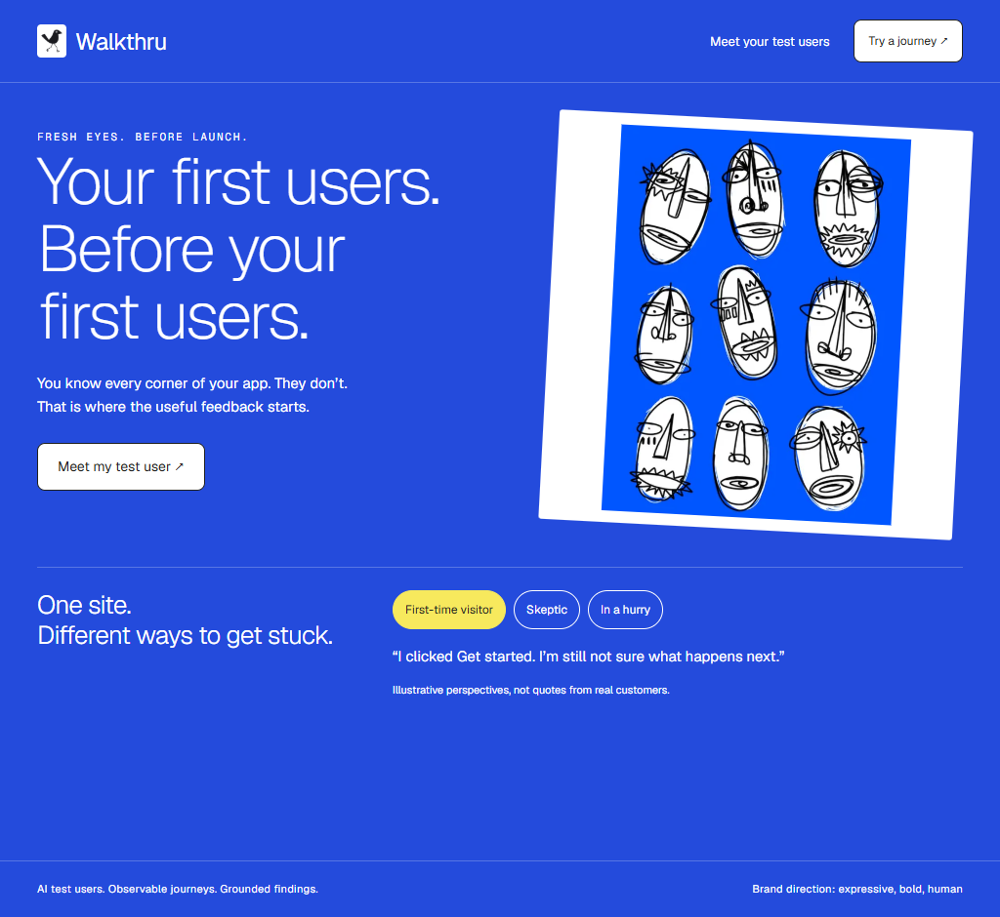 | 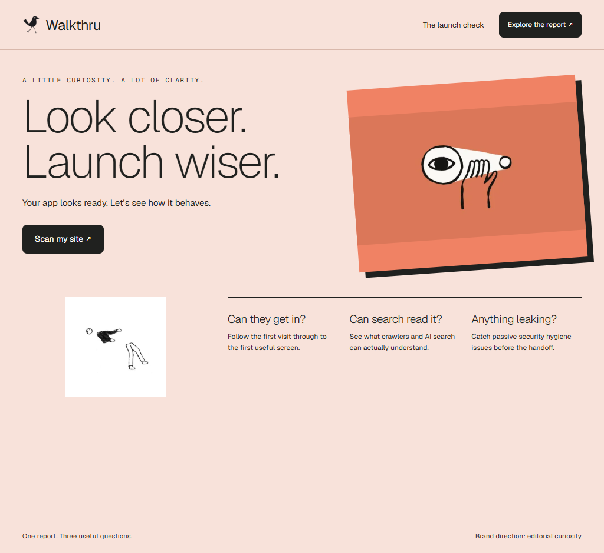 |
| **Launch Letter (founder homepage)** | **Launch Notebook (first-run setup)** | **Fieldwork (dashboard)** |
| 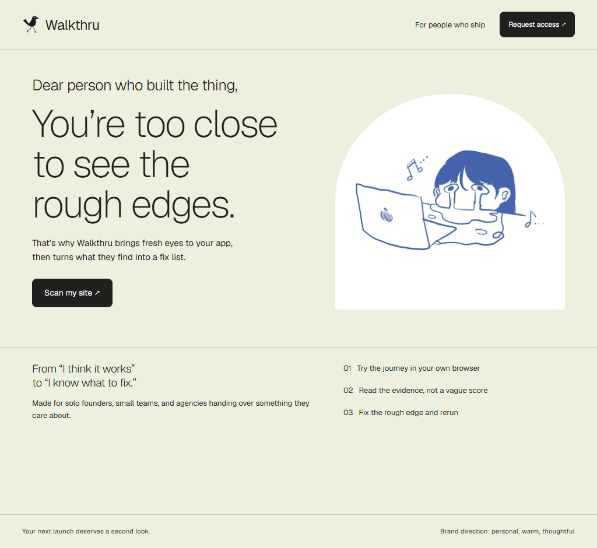 | 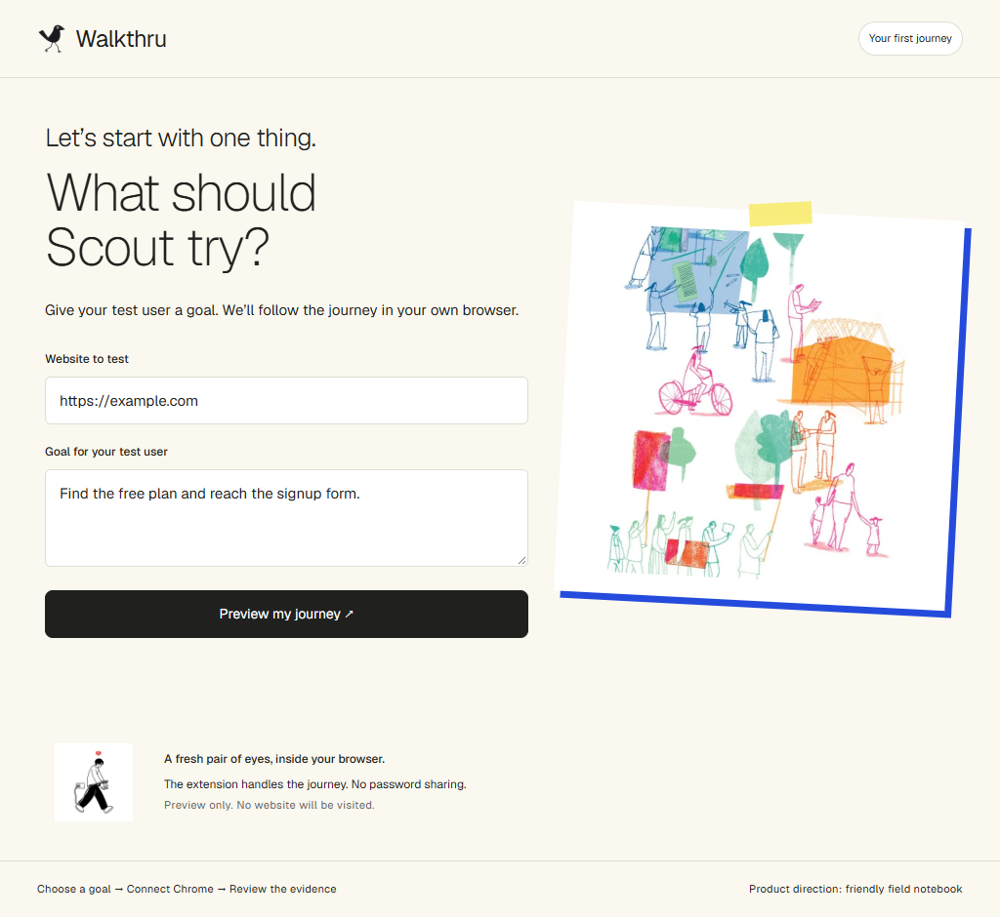 | 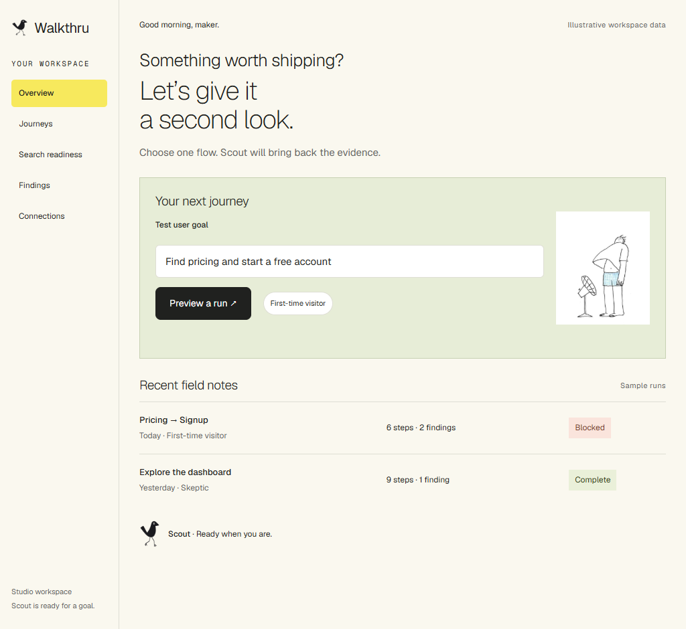 |
| **Journey Room (evidence report)** | **Search Atlas (AI readiness)** | **Fix Studio (prioritised fixes)** |
|  |  | 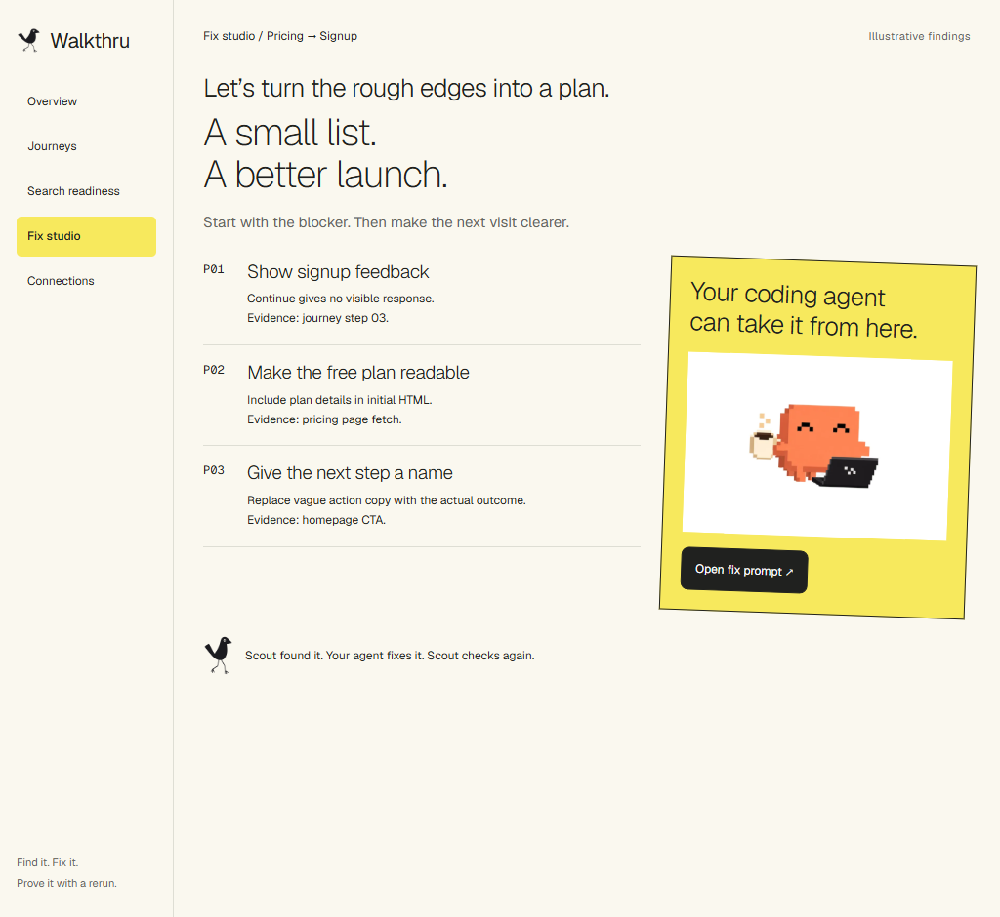 |
| **MCP Workshop (editor connections)** | **Release Radar (rerun compare)** | **Agency Wall (team findings)** |
|  |  |  |
| **Launch Day (completion and return)** | | |
| 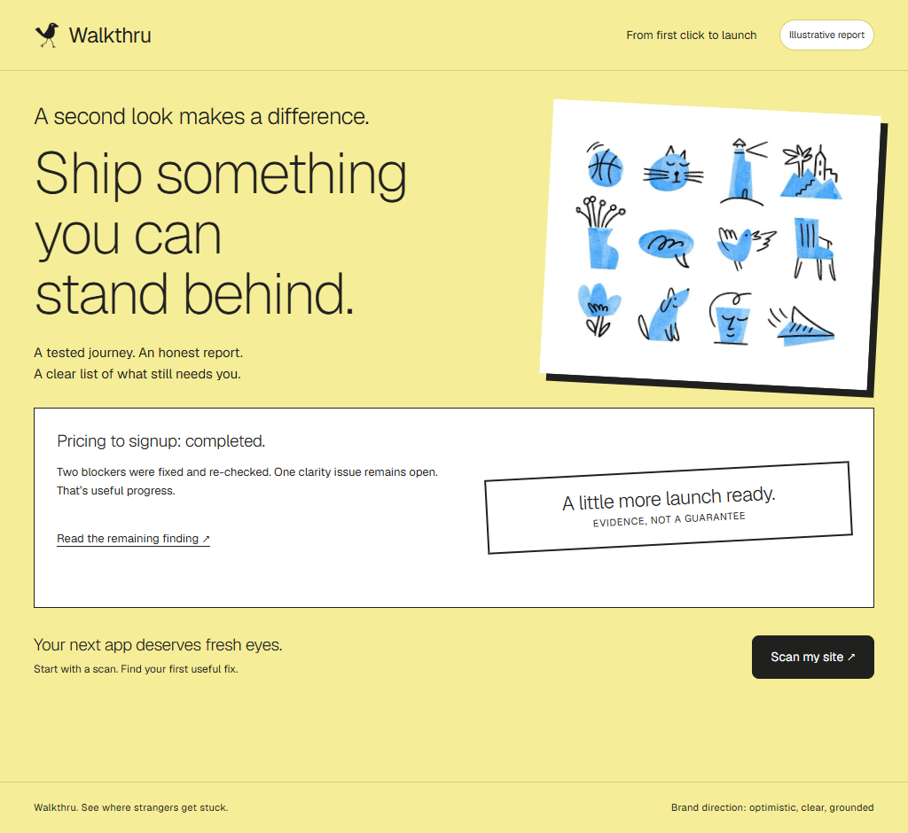 | | |

Source sheets used to build them:

| Doodles | Illustrations | MCP and Claude |
|---|---|---|
|  | 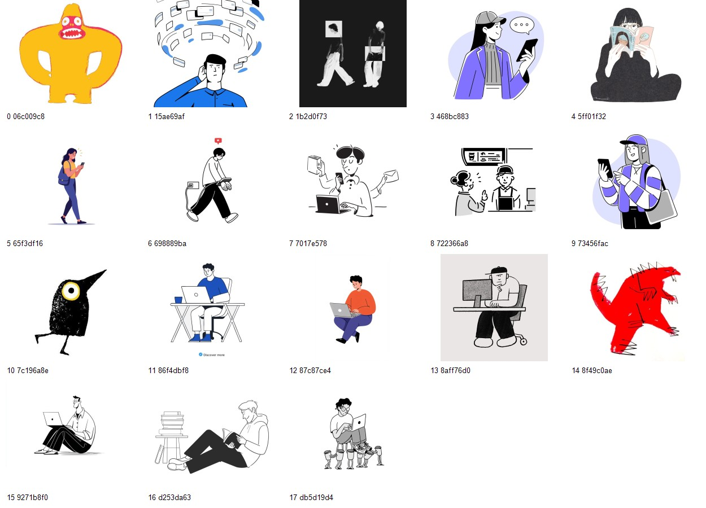 |  |

### Campaign posters

Ten posters in ten aspect ratios built from the same artwork and the site's Geist type. Gallery and sources: [`apps/web/design/doodle-posters/`](apps/web/design/doodle-posters).


### Launch films

Three 60-second, 1920x1080 launch films made with Hyperframes, each with Scout as the AI test user. Click a frame to open the MP4. Sources, tools and re-render steps: [`apps/web/design/launch-videos/README.md`](apps/web/design/launch-videos/README.md).

| A. Ship Friday | B. Every Stranger | C. Not a Scanner |
|---|---|---|
| [](apps/web/design/launch-videos/walkthru-launch-A-ship-friday.mp4) | [](apps/web/design/launch-videos/walkthru-launch-B-every-stranger.mp4) | [](apps/web/design/launch-videos/walkthru-launch-C-not-a-scanner.mp4) |
| Product-led: real captures, the agent loop, MCP, the report, a fix pull request. | Bold shapes: a word wheel of features, five coloured Scouts, the findings table. | Editorial manifesto: one phrase per beat, illustrated crowd, real footage. |

The 30-second cut ([`launch-video-30s/`](apps/web/design/launch-video-30s)), frame by frame:

[](apps/web/design/launch-video-30s/walkthru-launch-30s.mp4)

### Diagrams in this README

The hand-drawn diagrams are generated from code: specs in [`docs/diagrams/diagrams.js`](docs/diagrams/diagrams.js), drawn by [rough.js](https://roughjs.com) (MIT) in Excalidraw's Virgil font (OFL), both loaded from unpkg at render time. Re-render after editing a spec:

```bash
node docs/diagrams/render.cjs
```

The script needs Playwright with Microsoft Edge (set `PLAYWRIGHT_PATH` if `playwright` is not resolvable).

---

## Repository layout

```
apps/web/          React 19 + Vite + TypeScript + Tailwind v4 + GSAP
  src/pages/       One file per page (Landing, Login, Dashboard, Report, Compare, Watch, Visibility, Teams, Mcp, ...)
  src/components/  Shared UI (Nav, Pricing, Faq, ScanForm, Footer, Logo, Loading orbs, team/*)
  src/lib/         supabase.ts, auth.ts, runs.ts, teams.ts, motion.ts, session handoff to the extension
  src/content.ts   All marketing copy
  public/assets/   Images and product screens
  design/          mocks/, doodle-exploration/, doodle-posters/, launch-videos/, launch-video-30s/, source-images/
apps/api/          FastAPI + LangGraph
  app/             main.py (routes), agent/, scans/, jobs.py, limits.py, abuse.py, idempotency.py, migrate.py, mcp_server.py, teams.py, scout.py, ...
  migrations/      0001_initial.sql, 0002_agent_checkpoints.sql, 0003_run_idempotency.sql
  admin/           Local founder admin panel
  scripts/         test_user.py, grant_plan.py, billing.py
  tests/           pytest suite
  requirements.lock  Pinned, tested Python dependencies
apps/extension/    Chrome MV3 extension (WXT + React)
  entrypoints/     background, inject (page script), sidepanel
  lib/             snapshot, redact, execute, safety, evidence, diagnostics, api, session
  tests/           vitest
evals/             fixtures/easy, fixtures/hard, showcase, traps.json, serve.py, e2e_extension.py
docs/              Deploy, billing, system design, agent safety, auth sessions, idempotency, provider resilience, ...
  diagrams/        Hand-drawn README diagrams (specs, renderer, PNGs)
  readme/          README screenshots
dev.py, dev.cmd    One-command dev stack (development only)
```

---

## Run it locally

### Prerequisites

- **Python 3.12+**
- **Node.js 20.19+** (Vite 8 and WXT)
- **Google Chrome** (for the extension)
- A **Supabase** project (free tier is enough): URL, publishable key, secret key and a Postgres connection string
- A free **Groq** API key and a free **Google AI Studio** (Gemini) key
- Optional: PageSpeed API key, Resend key, LangSmith key, OpenRouter key, Dodo test-mode keys

### 1. Clone and configure

```bash
git clone https://github.com/watermelon588/Walkthru.git
```

Every variable is listed with comments in [`.env.example`](.env.example). Copy the API block into `apps/api/.env` and the `VITE_*` block into `apps/web/.env`. For the extension, copy `apps/extension/.env.beta.example` to `apps/extension/.env`. Never commit any `.env` file.

Minimum for a local run:

| File | Variables |
|---|---|
| `apps/api/.env` | `GROQ_API_KEY`, `GOOGLE_API_KEY`, `SUPABASE_URL`, `SUPABASE_PUBLISHABLE_KEY`, `SUPABASE_SECRET_KEY`, `DATABASE_URL`, `WEB_URL=http://localhost:5173`, `ALLOW_LOCAL_SCANS=1` (to scan the local fixtures) |
| `apps/web/.env` | `VITE_SUPABASE_URL`, `VITE_SUPABASE_ANON_KEY`, `VITE_API_URL=http://localhost:8010`, `VITE_EXTENSION_ID` (after loading the extension) |
| `apps/extension/.env` | `VITE_API_URL`, `VITE_WEB_URL`, `VITE_SUPABASE_URL`, `VITE_SUPABASE_ANON_KEY` |

If your network cannot reach Supabase's direct IPv6 host, use the session pooler string (port 5432) for `DATABASE_URL`. Never use the transaction pooler (6543).

### 2. Install the API and create the database

```powershell
cd apps/api
python -m venv .venv
.venv\Scripts\python -m pip install -r requirements.lock
.venv\Scripts\python -m pip install -e . --no-deps
.venv\Scripts\python -m app.migrate            # apply pending migrations (status, down also available)
.venv\Scripts\python scripts/test_user.py      # optional: throwaway account and session for local testing
```

On macOS or Linux use `.venv/bin/python` instead of `.venv\Scripts\python`.

### 3. Install the web app and the extension

```bash
cd apps/web && npm install
```

```bash
cd apps/extension && npm install && npm run build
```

Open `chrome://extensions`, turn on **Developer mode**, click **Load unpacked** and pick `apps/extension/.output/chrome-mv3`. Copy the extension id into `VITE_EXTENSION_ID` in `apps/web/.env`. After every rebuild, click **Reload** on the Walkthru card.

### 4. Start everything with one command (Windows, development only)

From the repository root:

```powershell
.\dev
```

This builds the extension and starts the API (http://localhost:8010), the web app (http://localhost:5173) and the fixture sites (easy :8101, hard :8102, showcase :8103) with labelled output, and restarts the API when its code changes. Ctrl+C stops all of them. `dev.py` and `dev.cmd` are development conveniences and are removed before production.

### Or one process per terminal (any OS)

```bash
cd apps/api && .venv/Scripts/python -m uvicorn app.main:app --host 127.0.0.1 --port 8010
```

```bash
cd apps/web && npm run dev -- --host 127.0.0.1 --port 5173
```

```bash
apps/api/.venv/Scripts/python evals/serve.py
```

### 5. Try a run end to end

1. Check http://127.0.0.1:8010/health.
2. Sign in at http://localhost:5173/login (the dashboard hands your session to the extension).
3. Open http://127.0.0.1:8101 (easy) or http://127.0.0.1:8102 (hard).
4. Open the Walkthru side panel from the Chrome toolbar.
5. Enter a goal such as `Sign up for an account`, pick a test user and click **Start test**.
6. When it finishes, open the report from the side panel or dashboard and check the steps, screenshot evidence, Share, Email me, CSV export and Save PDF.

The showcase fixture (http://127.0.0.1:8103) is a well-built product site whose journeys hold deliberate traps: circular links, a cookie banner, a newsletter pop-up, a dead button, new-tab and external links, content hidden until scrolled, and Pay and Delete buttons Walkthru must never press.

### Useful extras

```powershell
# Drive the built extension's page script in headless Chrome through the real API and model, then print the report
apps\api\.venv\Scripts\python evals\e2e_extension.py https://your-site.vercel.app "Find the projects and a way to get in touch"

# Free accounts get 3 runs a month. Give a test account a dev pass to try paid plans (no payment involved)
apps\api\.venv\Scripts\python apps\api\scripts\grant_plan.py you@example.com pro     # --revoke ends it

# Run background jobs in their own process (set JOB_WORKERS=0 in the API first)
cd apps/api; .venv\Scripts\python -m app.jobs

# Founder admin panel on http://127.0.0.1:8020 (this computer only)
cd apps/api; .venv\Scripts\python -m admin setup; .venv\Scripts\python -m admin
```

To test a real form send on the easy fixture as a verified owner, write your verification token to `evals/.walkthru-token` (git-ignored; see `GET /verification`) and run with `AUTO_CONFIRM=1`. Without it the run stops at the send button.

---

## Testing and checks

All of these must stay green before a push.

```bash
cd apps/api && .venv/Scripts/python -m pytest -q && .venv/Scripts/ruff check .
```

```bash
cd apps/web && npm run build && npm run lint
```

```bash
cd apps/extension && npm test && npx tsc --noEmit && npm run lint
```

At the last full run (2026-10-02): 711 API tests passed (plus real-Postgres RLS and PostgREST suites that run when a live stack is configured), 90 extension tests passed, and the web build and lint were clean. Notable suites: the persona graph against scripted models, every `_enforce` and policy rule, idempotency races, SSRF address forms, circuit-breaker concurrency, team permissions, and an SQL test proving private, public and team report reads under RLS. CI (`.github/workflows/security.yml`) runs `npm audit`, `pip-audit` against `requirements.lock`, and gitleaks on every push.

---

## Plans

| | Free | Launch Pack | Pro | Plus |
|---|---|---|---|---|
| Price | $0 | $9 once | $19/mo ($15 founding) | $49/mo ($39 founding) |
| Test runs | 3 a month | 20 within 30 days | 40 a month | 150 a month |
| Steps per run | 12 | 30 | 30 | 30 |
| Pages the test user may enter | Public | Public and logged-in | Public and logged-in | Public and logged-in |
| Rerun compare, fix prompt, competitors | No | Yes | Yes | Yes |
| MCP server, weekly watch, team workspaces, custom test users | No | No | No | Yes |

Full table and what is still coming: [SPEC.md](SPEC.md#plans).

---

## License

Walkthru is released under the [MIT License](LICENSE). Copyright (c) 2026 Rohit Maity.

Third-party code and assets keep their own licences: reused open source is listed in [`apps/api/THIRD_PARTY.md`](apps/api/THIRD_PARTY.md), the Geist fonts ship with their OFL licence files, and rough.js (MIT) and the Virgil font (OFL) are only loaded at diagram render time.
