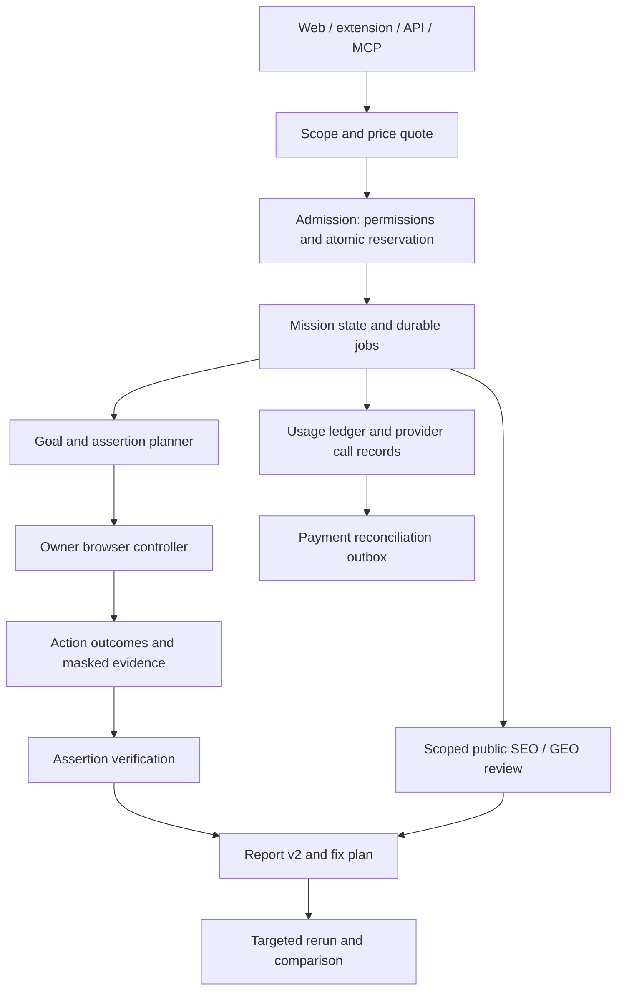

# Walkthru product and architecture restructure

Date: 2026-10-04. Status: proposed direction and executable implementation plan. This document does not change live prices, entitlements, model routing, safety policy or customer terms.

Implementation is divided into [focused sessions](docs/restructure-sessions.md), tracked in [the existing task list](tasks/todo.md#report-quality-restructure-workflow-2026-10-04). R-S1 and R-S2 completed 2026-10-04; R-S3 completed 2026-10-05. Richer grounded reporting, evidence readability, current masked browser context, revision-bound stale-target protection, controlled nested scrolling and bounded waits are verified. R-S4 task/persona separation and proven completion is next. The full report-v2/mission assertion contracts follow in later sessions; code completion does not imply model/pricing adoption or deployment.

The [SEO/GEO, report structure and efficiency extension](docs/seo-geo-report-expansion.md) records the founder's subsequent requirements and source audit: measured cache savings, slim paginated/indexed database reads, grounded keyword direction, twelve contextual backlink tactics, separate GEO/AI-citation chapters and consistent web/export/prompt/MCP output. The original twenty sessions retain their IDs; four pending focused slices make **24 planned slices, three completed**. Distribb informs research patterns, not an adopted dependency or paid link network. R-S4 is next.

## 1. Honest assessment

The current implementation has useful foundations, but the paid value proposition is not sufficiently demonstrated. A collection of familiar audit findings plus an unreliable browser journey is a weak reason for a capable developer to keep paying. The founder's dissatisfaction is supported by report and controller code. It does not establish that nobody will pay, or that adding every requested feature will fix demand.

I would reposition and validate Walkthru around **scoped release verification for authenticated web apps**: specify a valuable user outcome, execute it safely, inspect whether the expected result happened, show reproducible evidence, and verify the fix. Keep SEO/GEO as a separately scoped growth review that can attach to the same project. Do not make mastering all of QA, user research, technical SEO, content strategy, security and video production the initial launch requirement.

The promise to test a whole website must become a declared suite of journeys and assertions. A model cannot discover every hidden feature, infer every business rule or certify backend truth from screenshots. Sell tested scope and useful decisions, not an unsupported "everything passed" badge.

**Verdict: pivot the product promise and the unit of value; preserve the working infrastructure.** First prove a reliable, evidence-rich signup-to-first-value workflow on actual customer apps. A more expensive model is a candidate capability, not the differentiator by itself. The durable value hypothesis is saved investigation time and a reusable fix-and-recheck workflow.

### What this review actually checked

Read AGENTS, handoff, CURRENT_STATE, SPEC, ARCHITECTURE, DESIGN, SKILLS, ROADMAP, tasks, payment and existing founder documents. Documentation discovery audited actual report/schema/UI, controller/extension, scans, billing, MCP, emails, jobs, citations and saved fixture reports. Current primary sources were checked for competitors, Google Search guidance, web performance, payments, SMTP and model APIs.

Applied founder skills: validate-idea, pricing-strategy, mvp-scope, user-interviews and metrics-dashboard; make-plan supplied the discovery and phased implementation workflow. Detailed founder outputs are linked below. Other available skills do not improve this product/billing decision merely by being available.

No current paid customer counts, demand measurements, invoices or new live model benchmarks were supplied. Existing September 24 founder metrics are historical facts or targets, not October 4 traction. The saved Instant Scan screenshot inspected is also historical, not a newly generated premium report. Two saved September 30 journey reports and current source contracts were examined by the discovery audit.

## 2. What exists, what is weak, and what is missing

| Area | Current evidence | Keep and improve |
| --- | --- | --- |
| Browser journeys | Owner's Chrome, auth context, one-action observation loop, safety/idempotency, persona goals | Reliable target selection, nested scrolling, visual context, meaningful assertions and scoped suites |
| Report synthesis | `schema.py:173-175` asks for 3-4 sentences, at most 8 UX findings and 5 top fixes; `report.py:317` demands short one-sentence fixes | Brief executive summary with detailed inspectable evidence and diagnosis underneath |
| Evidence supplied to writer | `report.py:372` passes scanner titles, excluding much detail, fixes, page context and measurements | Feed a bounded structured evidence packet; do not expand prose from titles alone |
| Finding contract | `schema.py:103-112`: detail 600, fix 400, evidence 300 characters | Versioned issue record with expected/observed behavior, reproduction, confidence, hypotheses and acceptance criteria |
| Report UI | `ReportView.tsx:188` truncates evidence; diagnostic display shows only some captured issues | Accessible expandable issue details, full permitted evidence and separate coverage/limitations |
| Crawl | Public server HTML, up to 50 paid pages plus limited browser-visited URLs | Public crawl is not authenticated functional coverage; present both separately |
| Performance/accessibility | Browser axe/vitals; mobile PSI for up to 5 URLs when configured | Preserve actual metrics and add element/resource attribution, test conditions and measurement scope |
| SEO | Canonicals, duplicates, links, crawl depth, schema, images and other depth checks exist | Turn findings into page-specific priorities; keyword opportunity and Search Console remain unbuilt |
| GEO | Crawl/content/entity heuristics, fix pack and sampled API-answer tracking exist | Distinguish accessibility to bots, content advice, sampled citations and real traffic outcomes |
| Fix/recheck | Stack-specific recipes, fix prompt, comparison with "not rechecked" support | Make expected change and actual retest the center of the product |
| Visual replay | Up to 8 stored screenshots, slideshow/transcript | Evidence annotations first; evidence-derived clips later; continuous video is unbuilt |
| Billing | Founder-approved 30-day passes with fixed run counts | Optional workspace subscription plus capped prepaid task usage; monetary reservation is unbuilt |
| Email | Resend templates and DNS checks; no customer SMTP/inbox connector | Keep mail delivery separate from inference and clarify optional inbox-test scope |

Current deeper scanner capability matters: the claim that there are no metrics or useful non-DOM checks would be inaccurate. The missing product layer is evidence, causal context, functional assertions, prioritization and verified outcomes.

### Known credibility defect to fix before adding depth

The saved stopped run `evals/results/e2e-2e7fc3a801114f31955c88e814324a02.json` has zero executed actions, yet reports difficulty finding Explore with evidence citing confusion 0/3. CURRENT_STATE already records this. Keep it as a golden regression: an interrupted or navigation-only journey must not become a claim that signup failed or users struggled.

The controller audit also found no screenshot input, discarded geometry, snapshot-local IDs, fixed window-only downward scrolling and completion confirmation based on the last action rather than the requested outcome. The implementation detail and provider migration work are in [live decision quality plan](docs/live-decision-quality-plan.md).

## 3. Who should pay and why

Primary ICP hypothesis: a solo founder or small SaaS team shipping a logged-in workflow this week, without an established QA suite, who can state the intended result and supply a test account/dataset. Secondary hypothesis: a small agency producing a client handover that needs a dated evidence packet and a verified retest.

The strongest purchase moment is concrete: "We changed onboarding yesterday. Can a new account reach its first useful result, and can we reproduce any failure before customers see it?" A person with occasional needs should be able to buy one job without a subscription. Recurring subscriptions must earn their keep through repeated releases, history, suites, coordination and alerts.

The alternatives are real. Checked 2026-10-04, primary published claims rather than independent performance measurements:

| Alternative | Public capability or offer | What Walkthru must add |
| --- | --- | --- |
| [Lighthouse](https://developer.chrome.com/docs/lighthouse/overview) | Open-source audits for performance, accessibility, SEO and more | Context across a real business flow, reproducible functional evidence and fixes verified against that flow |
| [Checkly](https://www.checklyhq.com/pricing/) | Hobby lists 1,000 browser/10,000 API runs monthly; Starter displayed at $24/month billed annually | Faster setup and useful investigation for a builder without authored Playwright tests; raw run counts are not comparable |
| [BrowserStack Test Companion](https://www.browserstack.com/test-companion) and [pricing](https://www.browserstack.com/pricing) | Natural-language tasks, generation and diagnosis; Individual $25 and Pro $99 monthly, annually billed | Prove workflow and trust advantages; these prices are Test Companion, not a price quote for its separate agentic Low Code product |
| [PostHog Session Replay](https://posthog.com/session-replay) | Real-user replay with first 5,000 recordings monthly free | Pre-release testing before real users arrive; synthetic personas do not replace real user research |
| [Screaming Frog](https://www.screamingfrog.co.uk/seo-spider/pricing/) | Free up to 500 URLs; paid £199/$279 USD annually per user | Prioritized decisions and verification, not repackaging crawl inventory |
| [QA Wolf](https://www.qawolf.com/service/software-testing-company) | Agents plus QA engineers, maintained tests and evidence; dollar quote not verified | Honest unattended-versus-human-reviewed scope and reproducible failures |

These offers show substitute pressure and an existing category. They do not prove Walkthru willingness to pay. Do not claim exclusive credential privacy: competitor approaches have not been comprehensively audited. Owner-local testing avoids handing over a login password, but selected page content and masked evidence still reach configured processors.

### Three validation experiments before a broad rewrite

These thresholds are proposed founder decision gates, not industry benchmarks. No outreach or checkout is authorized by writing them.

1. **Scoped founder pilot:** recruit 10 builders releasing within 14 days. Offer one signup-to-value test, evidence and one retest for a proposed $19 pilot. Manually review findings. Pass: 3 actually pay and 2 use/confirm a material finding. Estimate 7 days and $0-100 excluding founder labor.
2. **Agency handover pilot:** 5 agencies with active deliveries; proposed $49 package on their authorized staging app. Pass: 2 paid pilots and 1 repeat purchase. Estimate 14 days and under $150 excluding labor. This is a service experiment, not proof of automated margins.
3. **Substitute/time comparison:** 6 qualified builders use their normal free tools, then the Walkthru packet on the same scoped task. Track investigation/reproduction time and disputes. Pass: 4 finish independently, 3 choose the paid offer, no unsupported defect sold. Estimate 10 days and under $120.

If buyers value the packet only because the founder manually diagnoses it, measure that labor and investigate product automation. If failures persist after 10-15 qualified attempts, revise ICP/promise before adding video, general API proxying or more scanners.

## 4. The paid product: missions, suites and assertions

Call a purchased job a **test mission** in product language. Its unit of value is a declared outcome and an evidence packet, not an arbitrary scan count or token count.

Each mission contains:

- Objective, environment, verified site, allowed origins, device/viewport, actor/persona and authorized account context.
- Expected outcomes and assertions, owner-provided test data, side-effect constraints, allowed actions and human handoffs.
- Budget/time/page limits, model quality profile and accepted maximum usage charge.
- Observations, actions, outcomes and evidence, kept separate from model interpretations.
- Completed/blocked/failed/not-tested status per scenario and assertion, plus coverage and remaining uncertainty.

An owner-defined suite combines signup, onboarding, first useful action, dashboard navigation, filters, pagination, settings and selected responsive states. Traverse only what the declared scope and budget permit. A list of discovered routes is not a complete list of all possible app states.

### Functional analysis worth paying for

| Scenario | Useful assertion | Required evidence |
| --- | --- | --- |
| Signup to first value | Account reaches expected welcome/dashboard state | Actual transitions and finish condition; a login link alone is not completion |
| Dashboard filters | Known dataset yields the expected visible row set/count | Declared fixture/time/window, selected filters and observed results |
| Pagination | Selected record is preserved or reset as specified | Stable record identity and page state before/after |
| Form correction | Invalid data shows the specified error; valid correction clears it | Field constraint, redacted synthetic input and observable result |
| Save and revisit | Authorized staging change persists after refresh/revisit | Before/after record identity and value assertion; optional read-only API corroboration |
| Empty/loading/error states | UI communicates the relevant state without contradictory success | Real state evidence; intentionally inducing server failures requires a separate authorized fixture |
| Different roles | Declared role sees the expected permitted surface | Explicit scoped test accounts and expected policy; UI visibility does not prove backend authorization |

For real-data comparisons, start with owner-provided synthetic fixture expectations and selected visible records. Optional read-only API connectors can later supply ground truth. Define tolerances, units, timezone, rounding, pagination and dataset timestamp. Do not send whole customer tables, tokens or broad service-role credentials to models. Report unmatched or stale datasets as inconclusive, not defects.

A stronger controller can propose relevant paths, understand layout and interpret observed state. It cannot reliably infer unstated accounting rules, recover inaccessible data or certify that money moved correctly. A persona's invented frustration is not measured human conversion loss.

### Side effects and authenticated flows

Keep production exploration read-only except actions explicitly allowed by the current verified-owner confirmation contract. Wider repeated create/edit/signup testing requires a new staging/test-data policy and review before implementation. Do not implement backend writes, bulk actions, payment submission, destructive clicks, CAPTCHA solving or unauthorized role probing under this planning request.

Magic links, OTP and MFA require a human handoff or narrowly authorized dedicated test-inbox integration. An interruption can preserve a partial report and resumable state. Do not quietly store a customer's password or personal mailbox credentials to make unattended tests convenient.

## 5. The report should explain, demonstrate and verify

Keep a concise first page, then detailed evidence on demand. There is no minimum word count or required defect count. A trustworthy clean mission can have few findings. Depth comes from demonstrated assertions and actionable diagnosis, not padding.

R-S5a implements prominent, navigable chapters for journey/UX, accessibility, performance, SEO foundations, keywords/content, authority/backlinks, GEO readiness, sampled AI citations, security/email and evidence/coverage. Each has a plain-language summary, sourced findings or opportunities, solutions and verification; shared root causes cross-link instead of duplicating defects. Print/export, section fix prompts and bounded MCP views use the same saved contract. See the [chapter specification](docs/seo-geo-report-expansion.md#report-chapters-one-navigable-dossier).

### Versioned report v2

Proposed records, not existing contracts:

```text
MissionReport:
  version, mission_id, objective, environment, actor, scope
  coverage: scenarios/assertions declared, tested, blocked, not_tested
  outcome, limitations, model_provenance, actual_usage_charge
  issues[], passed_assertions[], incomplete_assertions[], evidence_index[]

Issue:
  id, scenario_id, affected_states, severity, confidence
  observed_fact, expected_result, actual_result, reproduction_steps
  evidence_refs, impact_explanation, cause_hypothesis
  proposed_change, acceptance_test, recheck_status
```

Use stable evidence references instead of a clipped free-text evidence string. Validate issue claims against the relevant outcome, not merely whether the model cited a step. Separate facts, uncertain causes, subjective usability observations and recommendations. A CSS concern, a blocked payment, and a failed persistence assertion need different wording and priorities.

Group duplicate technical issues by root cause while preserving affected pages and individual evidence. Rank by blocked customer task, measured frequency within tested scope, affected declared journeys, severity, confidence and fix effort. Unknown revenue/conversion impact stays unknown. A high Lighthouse score does not override an observed signup failure.

### Example of stronger output

**Illustration, not a discovered defect:** "Editing Project B changes the detail panel but Save updates Project A. Reproduced twice in the declared staging fixture. Expected: Project B keeps the new name after refresh. Observed: B retains its old name and A changes. Evidence: steps 18-24, before/after frames and read-only fixture response. Suspected cause: selected row state and form record ID disagree. Verify by selecting B, saving a unique synthetic label and refreshing both records."

The model must not claim that suspected cause as proven without code or corresponding evidence. This output is more valuable than "the form is confusing" because the owner can reproduce, repair and recheck it.

### Visual contrast and video

1. Core report includes actual captured screenshots with issue locations, expected-versus-observed text and evidence timeline.
2. Proposed layout/copy treatment appears alongside the observed screen, clearly labelled a suggestion. An AI mockup is not a repaired screenshot.
3. Verified before/after uses a real rerun with matched environment, dataset, viewport and assertion. Mark unrelated changes and missing comparisons.
4. Later offer a short evidence-derived highlight clip with step timestamps and optional narration. It must use real captured frames; do not generate fictional test events.
5. Continuous tab recording is optional, not core launch scope. It needs explicit user initiation, permissions, masking/capture design, retention/storage budgets and failure handling. Existing eight screenshots are not continuous video. Follow [Chrome tabCapture](https://developer.chrome.com/docs/extensions/reference/api/tabCapture) and [screen capture guidance](https://developer.chrome.com/docs/extensions/how-to/web-platform/screen-capture) before designing that path.

Keep reproduction, basic screenshots, substantive evidence and acceptance tests in the mission price. A customer must not buy an add-on to understand an issue they already paid to discover.

## 6. SEO and GEO should answer concrete growth questions

Separate the growth review from the authenticated dashboard test. Indexing a private dashboard is usually not the growth objective. The owner selects public commercial/content pages, product audience, geography and desired outcomes.

R-S17 expands keyword/intent-to-page direction; R-S17a adds [all twelve requested backlink tactics](docs/seo-geo-report-expansion.md#backlinks-twelve-tactics-evaluated-applicable-ones-recommended) as a contextual recommendation catalog, with required data and applicability. Reports can suggest useful assets, supported editorial opportunities and drafts, without automatically sending outreach or publishing. Search Console is not a complete backlink index; new sites receive explicitly hypothetical keyword direction. GEO readiness, legitimate authority and measured citations remain separate. Exclude automated ranking-link placement and reciprocal/triangular exchange campaigns as shortcuts.

### Three data levels

| Level | Inputs | Credible output |
| --- | --- | --- |
| Technical inventory | Existing crawl, rendered comparison, sitemap/robots, schema, metadata, links | Observed indexability/readability issues and exact affected pages; not proof of index inclusion |
| Content opportunity | Actual product copy and owner business brief; optional Search Console | Intent/topic hypotheses; with observed queries, page/query opportunities and cannibalization signals |
| Measured growth/visibility | Owner-authorized Search Console, optional analytics; scoped paid keyword/SERP/answer sampling | Observed traffic/query trends and dated search/retrieval evidence; no guaranteed ranking or citation |

Search Console/Bing connectors are currently unbuilt. [Search Analytics query](https://developers.google.com/webmaster-tools/v1/searchanalytics/query) supports page/query dimensions and read-only authorization, but returns bounded top rows rather than every query. Explain omitted/low-data periods and compare consistent windows. API-answer visibility is not consumer ChatGPT visibility; sampled citations are not market share.

### Deliverables instead of vague advice

- Query/intent-to-page map: current landing page, supported topic, proposed target page and reason it fits the actual product. For a new site with no demand data, label suggested keywords as hypotheses.
- Existing-query opportunities: impression/click/CTR/position context, matched landing page and proposed improvement. Avoid treating a blended average position as a guaranteed rank.
- Page-specific content plan: current quoted copy, proposed title/description/section, unmet intent, factual claims requiring owner verification and internal links from named pages.
- Cannibalization review: overlapping query/page evidence, whether intents really conflict, merge/reposition/link recommendation, and follow-up measurement.
- Content briefs: proposed audience question, outline, product-specific evidence/examples and success measurement. Do not publish generated content or manufacture statistics/testimonials.
- Technical fix plan: exact URL, raw/rendered evidence, affected template, suggested implementation and retest. Recalibrate simplistic fixed-title-length, exactly-one-H1 and universal impact rules against current official guidance.
- Optional paid demand research: disclose engine/location/language/date and provider/source. [DataForSEO search-volume API](https://docs.dataforseo.com/v3/keywords_data-google_ads-search_volume-live/) returns keyword metrics, but requires paid data access. Advertising competition is not organic keyword difficulty. Do not invent search volume, organic difficulty, CPC or competitor backlink counts from an LLM.

### GEO honesty rules

Google says foundational SEO remains relevant to AI Overviews/AI Mode, with no extra special optimization or required AI files/schema; eligibility does not guarantee inclusion. [Official AI features guidance](https://developers.google.com/search/docs/appearance/ai-features).

Retain clear crawl/rendered-text checks, useful evidence-backed content, accurate entity facts, appropriate visible-content-matching schema and legitimate internal links. Treat llms.txt and optional discovery files as experiments, not essential rank factors. Owners may deliberately block training bots; that is not automatically a fault. Distinguish Google Search access from other providers' search/training crawler choices.

For each tracked prompt, show provider/model/date/location when available, response and actual referenced sources, mention versus citation and sample size. A memory-only answer cannot prove web retrieval. Record failed checks separately. Compare repeated controlled samples before interpreting movement; no causal claim that a copy change increased AI citations without enough evidence.

### Performance and accessibility with useful context

Keep PSI, browser diagnostics and axe; enrich their outputs before inventing more scores. Report lab conditions, device, URL and timestamp. Preserve relevant Lighthouse audit opportunities/resource or element attribution rather than returning only a performance score and a generic compression recommendation.

Track LCP, INP, CLS and supporting TTFB/FCP/TBT when actually available. Show loading/error states, layout overlap, keyboard navigation and form feedback in tested scenarios. Automated accessibility checks do not establish complete WCAG conformance.

LCP <=2.5 seconds, INP <=200 ms and CLS <=0.1 at the real-user 75th percentile are Google's good CWV thresholds. A single extension session is diagnostic evidence, not population p75; a lab TBT value is not measured INP. [Web Vitals](https://web.dev/articles/vitals). Evaluate a direct CrUX/CrUX History path when historical field data is required. Distinguish URL-level data from origin-level fallback, and confirm account quotas and current API response shape during implementation. [PSI guidance](https://developers.google.com/speed/docs/insights/v5/about).

A no-traffic new site may lack field data. "Unavailable" is the correct result. Do not present every possible metric as a checklist goal; prioritize signals tied to user impact and an actionable intervention.

## 7. Commercial structure: subscription plus prepaid usage

Agree with hybrid billing. Disagree with turning every report section into an add-on or exposing raw provider tokens as the main customer purchase unit.

- **Subscription buys workspace capabilities:** saved projects/suites, history, comparisons, collaboration, scheduled public checks, integrations, retention and coordination. It can include a spend balance.
- **Prepaid usage buys variable work:** deeper interactive missions, extra personas/devices, optional research and media processing. One-off users can buy usage without committing to a subscription.
- **Before dispatch:** display declared scope, estimate/range, included deliverable, accepted maximum charge and stopping behavior. No automatic top-up or postpaid overage by default.
- **Same minimum honesty on every plan:** higher plans allow broader coverage, more compute and more evidence. They do not make a false claim more credible by virtue of the price tier.
- **One wallet across entry points:** web, extension, API, MCP, Scout, watch, citations and add-ons. Opening a connector does not create a second free pool.

### Draft offers for validation, not activated prices

| Offer | Proposed price | Usage balance | Platform access and upgrade trigger |
| --- | ---: | ---: | --- |
| Explore | $0 | Bounded trial set by measured funded cost | One project, exact technical findings/sample dossier; upgrade for further mission work. No unlimited premium trial promise |
| Pay as you go | Minimum $10 top-up | $10 service usage balance | One project, one active job, basic evidence/history; appropriate for occasional launches |
| Pro | $29 per 30 days | $10 service usage per period | 2 projects, saved missions, comparisons, manual reruns, 30-day evidence retention target, scoped API/MCP and spend caps |
| Plus | $79 per 30 days | $35 service usage per period | 5 projects, up to 3 seats, shared suites/board, branded exports, per-key limits, 90-day evidence retention target, public monitoring and approval workflows |

These are price-test hypotheses, not a recommendation to replace current checkout today. Extra task usage applies to either paid tier. More retention and unattended automation must be priced from observed storage and compute cost. Pro initially one active interactive mission, Plus at most two only after capacity tests. Historical founding promises and existing purchased entitlements must be audited and honored before migration; no assumed conversion of runs into lower-value balances.

Initially sell founder-approved 30-day access and top-ups using the existing review process. Activate recurring subscription billing only after explicit opt-in and proven settlement/revocation. Possible later annual offers: $290 Pro/$790 Plus, 16.7% off 12 monthly periods, with usage granted monthly. Defer annual sales until costs, retention, refunds and paid value are known.

Keep balances simple: included promotional balance and purchased balance recorded separately; draw expiring included grants first. Proposed included grants expire at period end; purchased service balance does not expire during the pilot and can be used without an active subscription within PAYG limits. Publish any eventual expiry/refund policy before purchase. Version each grant and do not retroactively erase balances. Stored reports remain readable after subscription expiry; premium collaboration/automation follows entitlements.

### Cost and margin model

Use provider costs internally; expose service prices and hard caps to customers. A dollar of service credit is not a dollar of provider spend. Store financial amounts as integer micro-units with currency and price version, never floating-point wallet arithmetic.

**Illustrative starting catalog policy:** customer usage price = 5 x measured fully loaded variable cost. Variable cost includes all provider input/output/reasoning/images/cache writes, retries, tool/data charges, job compute and evidence storage/egress at the promised retention. No measured Walkthru deep-mission cost is available; replace examples after benchmarks. List prices are fixed for the accepted quote version, not changed underneath an executing job.

Sonnet global $2 input/$10 output per million is the initial quality candidate, not a selected winner. [Google pricing](https://cloud.google.com/vertex-ai/generative-ai/pricing). Trial credit is not a durable operating subsidy. Compare Sonnet, full GLM and optional Grok on quality and cost per correctly completed task.

| Hypothetical mission | Billed tokens across controller/report | Model cost, Sonnet | Other variable cost/reserve assumption | Total cost | Illustrative usage price |
| --- | --- | ---: | ---: | ---: | ---: |
| Focused | 55k input, 9k output including reasoning | $0.20 | $0.05 | $0.25 | $1.25 |
| Deep suite | 220k input, 26k output | $0.70 | $0.30 | $1.00 | $5.00 |
| Extended suite | 640k input, 70k output | $1.98 | $0.52 | $2.50 | $12.50 |

Token/step mapping is not a promise. Extended scopes exceed current hard limits and are unbuilt. Maximum cost must be reserved, not guessed from these averages. Cache savings are not assumed, and longer hidden reasoning can change bills substantially.

For illustration only, using the existing payment.md assumption of 4% + $0.40 checkout fees, not a newly verified commercial quote:

- $10 top-up: $0.80 fee; up to $2 variable work at 5x pricing; contribution $7.20 before shared fixed costs. Fractional usage charges are internal, not separate card transactions.
- Pro $29: $1.56 fee + up to $2 included-work cost + assumed $2 hosting/storage allocation + $6 support = $11.56 cost; $17.44 contribution, about 60.1%.
- Plus $79: $3.56 fee + up to $7 included-work cost + assumed $6 infrastructure allocation + $12 support = $28.56 cost; $50.44 contribution, about 63.8%.
- Illustrative shared fixed cost $100/month needs 6 Pro or 2 Plus customers at those contribution estimates; this is not an account budget or customer forecast. A hypothetical 70/30 Pro/Plus mix has $44 subscription ARPU and $27.34 average contribution before shared fixed costs. Exclude pass sales from MRR until actual recurring subscriptions exist.

Accounting boundary: the per-account infrastructure assumptions cover allocated customer-driven infrastructure; the $100 assumption covers remaining shared overhead. Do not count the same invoice twice. Track actual support time, founder review labor, refunds, retries, payment fees, taxes where applicable and heavy-user retention. If a manually reviewed pilot takes 30 minutes at an assumed $20/hour, add $10 cost; the self-serve examples do not apply.

Calculate allowed variable cost using `C <= revenue * (1 - target_margin - percentage_fee) - fixed_checkout_fee - allocated_other_costs`. Distinguish platform margin and usage margin. The old 25%-of-net provider allowance must be replaced deliberately in policy docs if the hybrid model is adopted, not silently ignored.

### Three things that must remain separate

| Item | Purpose | Pays for work? |
| --- | --- | --- |
| Walkthru API/MCP key | Scoped identity credential, revocable and hashed | No; it references an authorized wallet and spend cap |
| Service usage balance | Prepaid or included entitlement with ledger/grant rules | Yes, at the versioned service catalog price |
| Model-provider API credential | Walkthru's secret credential, optionally BYOK later | Funds inference at that provider; does not fund other Walkthru services |

MCP can trigger expensive jobs and must obey identical admission controls. If the founder meant MCP rather than SMTP, this is the exact protection needed. Current `wt_` keys are Plus access credentials, not credit tokens. Do not expose a generic unlimited model-proxy endpoint.

## 8. SMTP, notifications and signup email testing

There is no customer SMTP connector today. `apps/api/app/deliver.py` sends existing report/watch/invite templates through Walkthru's Resend account. It does not run an LLM. DNS email checks also do not call an LLM. [Supabase custom SMTP](https://supabase.com/docs/guides/auth/auth-smtp) configures authentication email delivery, not AI usage.

| Operation | AI usage | Other resource |
| --- | --- | --- |
| Save SMTP settings/send verification template | None unless explicit AI content generation is requested | Credential/security checks, delivery cost and rate quota |
| Email an existing report | No new inference | Email send and any export rendering/storage |
| Generate a new report/AI answer | Yes | Budgeted job and model calls, regardless of notification channel |
| Scheduled watch | Fresh check may use models even without an email | Monitoring/network resources plus generation; debit the accepted scheduled budget |
| Customer BYO SMTP | Transport cost may be paid by customer | Walkthru CPU/queue/storage and model work still require controls |
| Verify signup email/OTP | Only if an AI stage is actually used | Inbound test inbox access and correlation; SMTP alone cannot read received messages |

Defer BYO SMTP until agencies show a clear delivery/branding need. Keep template sends deduplicated and per-recipient/domain limited; retries must not regenerate reports. Connecting customer mail transport must not enable arbitrary recipients, bulk sends or expensive email-triggered AI jobs without admission.

For future signup verification, use a dedicated test inbox with narrowly scoped provider access or a human handoff. Correlate only the mission's recipient/event, bound polling, redact message content and verify link domains before opening. Do not ingest a user's whole personal inbox. Testing a fresh signup can also consume the tested site's own email quota; disclose and cap that separately.

## 9. Architecture: evolve the stack around evidence and admission

Keep React/Vite, extension, FastAPI/LangGraph, Supabase and the existing durable jobs/idempotency foundation. Planned hosting remains Cloudflare frontend/DNS with Google VM API/worker, Supabase and Hostinger business inbox. No infrastructure/provider change follows from this document. The mission engine is a bounded orchestration layer, not a collection of unconstrained autonomous agents.



### Budget controls are part of execution

1. Authorize the account/workspace, owned site, API scope, operation and quote. The client cannot choose a wallet identity, price or entitled tier.
2. Atomically reserve the accepted task maximum from available credit and the global funded provider budget. Check concurrency/daily caps in the same admission path. Commit before network/model execution.
3. Allocate phase budgets for planning, traversal, assertions, report and optional research/media. Reserve enough report budget to deliver partial evidence even if exploration ends early.
4. Record each provider attempt with a durable operation ID, quote version, input/output/cache/image/reasoning/tool usage and failure status. Unknown usage after a timeout is unknown, not zero.
5. Settle actual accepted charges and release unused reservation. Handle crash-after-provider-response and uncertain in-flight attempts without duplicate inference or double charging. Expiring a worker lease alone cannot safely release uncertain spend.
6. Preserve a partial dossier when a user stops or reaches budget. Resume only within accepted scope and remaining balance; never silently auto-top-up or replace the agreed controller with an unqualified cheaper model.
7. Export finalized ledger events to billing via a retryable outbox; provider billing and wallet state are reconciled. Never debit twice via local settlement and a payment meter without a defined ownership boundary.

Proposed persistence: billing accounts, grants/append-only ledger, reservations, versioned prices/quotes, provider attempts, missions/scenarios/assertions and evidence metadata. Reuse existing runs/jobs where practical; add small domain records only when needed. All are proposed, additive numbered migrations requiring the normal schema review, RLS and privacy/retention checks.

Reuse `docs/run-idempotency.md`, fenced citation admission, `app/jobs.py`, signed billing verification and shared rate limiting. They solve parts of execution; none is currently a complete financial reservation. Money admission must fail closed when authoritative storage is unavailable, even if an ordinary rate limiter currently fails open.

[Dodo credits](https://docs.dodopayments.com/features/credit-based-billing) support grants/subscriptions/top-ups, but the provider does not block zero-balance service usage and meter deductions are asynchronous. Enforce local admission. Export settled events with stable IDs following [usage event documentation](https://docs.dodopayments.com/developer-resources/usage-based-billing-guide), not a synchronous balance lookup on every click. Keep a clear billing authority and reconcile refunds/disputes, replayed/out-of-order webhooks and grant issuance exactly once.

### Browser-local versus unattended work

An API key can request work but cannot make a logged-out browser tab exist. Current interactive journeys need the connected extension and owner session. Surface that prerequisite in API/MCP and schedules. Public watch/scans can run on the server; they do not constitute weekly authenticated browser journeys.

Later unattended browser execution is a separate opt-in runner with isolated test credentials/data, per-job compute billing, egress/permissions controls and cleanup. Verify session lifecycle and operational costs before offering it. Do not move every customer session to the cloud as part of the first restructure.

## 10. Model and token policy

Evaluate Sonnet 5.5 for goal planning/live decisions first, full GLM 5.3 as the lower-cost text challenger and Grok 4.7 if needed. Choose by grounded task outcomes, latency and loaded cost, not vendor benchmark headlines. Sonnet requires the documented structured-output/effort migration; the existing Haiku adapter cannot simply change its model name.

Separate planner, controller, assertion interpretation, report and growth-review stages. Reuse collected evidence and deterministic measurement. Compact history to factual progress and recent outcomes while retaining unresolved uncertainty. Cache stable instructions/schema only where the provider supports it. Use targeted screenshot analysis when text is ambiguous. Account for reasoning and cache writes, not just visible reply length.

Use stronger reasoning where the next decision matters; a second agent on every click adds cost and may repeat the same mistake. A richer report receives richer evidence, appropriate output budget and claim checks. Its wording can take longer without making browser interaction unnecessarily slow.

Record truthful provenance per stage. Failures are classified as provider/controller/site/safety/user/budget outcomes. No model or tier promises zero hallucinations. Retain existing safety checks and stop rather than guessing a high-risk action.

## 11. Scope and build order

| Category | Work | Reason |
| --- | --- | --- |
| Must | Controller reliability, report v2 evidence, scoped assertions, usage admission, one qualified paid flow | Without these, the new purchase promise is unsupported |
| Should next | Saved suites, targeted reruns, form/SPA/scroll coverage, price quotes, API/MCP wallet enforcement, source attribution | Makes repeated release testing useful and sustainable |
| Should after mission validation | Search Console opportunities, content/page map, resource-level performance diagnosis | Adds contextual growth value using real data |
| Later add-on | Extra roles/devices/personas, paid keyword research, evidence highlight clips, longer retention | Additional variable work with visible budget |
| Defer | Generic model proxy, broad SMTP connector, personal inbox ingestion, cloud runner, continuous recording, autogenerated application repairs | Separate operating/security problems; customer demand and cost not proven |

Core first-release flow: select project and outcome; review scope/test data/maximum charge; start in connected browser; inspect dossier; fix and rerun the selected assertion. The actual execution may take minutes. Do not advertise an arbitrary 60-second full-test promise.

### Phase 0: discovery and baseline, completed in this review

- **Work:** consolidate current contracts and real saved failure examples; retain known scanner and billing facts above.
- **References:** listed repo files, discovery source audits, [live decision plan](docs/live-decision-quality-plan.md), provider/market sources in this file.
- **Verification:** facts marked implemented/proposed/unmeasured; no paid calls or current-customer assumptions. No stale architecture graph used as authority.
- **Guards:** no invented customer demand, falsely exclusive privacy claim, or universal application coverage.

### Phase 1: trusted dossier from existing evidence

Estimate: 3-5 focused solo-development days, excluding approvals and live acceptance.

- **Implement:** copy current `synthesis_inputs`/scan-merging/comparison patterns into a versioned report contract. Supply bounded details/evidence instead of scanner titles only. Add expected/observed/reproduction/acceptance fields and coverage first. Expand permitted evidence UI without dumping raw payloads; preserve legacy report rendering.
- **References:** `app/agent/report.py:317-426`, `schema.py:103-112,173-175`, `app/agent/compare.py`, `ReportView`, `EvidenceTimeline`, `BrowserDiagnostics`, DESIGN.
- **Verify:** stopped-zero-action report cannot invent Explore confusion; navigation-only report cannot imply signup completion; recommendations distinguished from observations; long details inspectable; no new unsupported visual claims. Human review on saved clean/failure reports.
- **Guards:** do not solve shallowness by merely raising a finding count or verbosity. No re-generation of old reports at paid cost without admission.

### Phase 2: controller and minimal assertion engine

Estimate: 5-10 days plus bounded model evaluation.

- **Implement:** execute the linked live decision phases using current snapshot geometry/redaction/settle/executor patterns. Add current-state regions, target revision, form constraints, nested scroll and bounded waits. Use owner-defined objective and evidence-based finish condition. Add read-only/fixture assertions for the golden signup/dashboard/filter journey.
- **Evaluation boundary:** before phase 3 financial admission exists, allow only a separately founder-authorized, dollar-capped evaluation on stored observations or owned fixtures, with explicit provider usage tracking. This is not an ordinary customer paid route. Customer paid missions follow phase 3. Use human-prepared test accounts or the existing permitted single confirmed signup; broader staging mutations require the expanded action policy first.
- **References:** `snapshot.ts:137-199`, `execute.ts:40-105`, `persona.py:109-264`, `goal.py`, `runtime.py:103-129`, official model references in the linked plan.
- **Verify:** stale/duplicate targets, same-URL updates, unrelated notices, correction of form data and correct safe stops. Test baseline and stronger candidates on the same owned scenarios. Distinguish site block from controller loss.
- **Guards:** no unbounded dynamic JS or arbitrary coordinate clicks, no staging mutations before the expanded action policy is reviewed. Larger context is not a substitute for scoped state.

### Phase 3: cost records, reservations and quote UI

Estimate: 5-8 days plus schema activation/SQL concurrency acceptance. This precedes any general paid-model adoption.

- **Implement:** copy existing signed/idempotent billing, fenced claims and job patterns to the proposed ledger/reservation/quote/provider-call model. Route every expensive entry point through atomic admission; reserve reporting separately. Add transparent estimate/maximum/settlement history and global kill switch.
- **References:** `payment.md`, `app/billing.py`, `app/plans.py`, `app/mcp_server.py`, `app/scout.py`, `app/watch.py`, `app/citations.py`, `app/jobs.py`, run-idempotency and Dodo docs above. Inspect installed SDK signatures before assuming credit APIs.
- **Verify:** racing requests cannot overspend; shared workspace/API/web spend is counted; exact replay no double charge; timeout/crash/lease expiry preserves uncertain reservations; unavailable ledger fails closed; report remains deliverable at exploration cap.
- **Guards:** no count-then-charge race, client price identity, synchronous payment balance as authority, fixed fee per click, or unbounded free retry loophole.

### Phase 4: founder-reviewed paid pilots and pricing decision

Estimate: 7-14 elapsed days; can overlap controlled engineering validation. No public recurring launch yet.

- **Implement:** prepare one complete owned-app example and proposed paid pilot quotes. Run customer research and approved small paid missions only after model budget authorization. Capture time saved, disputes, repairs, retests, actual invoices and human review labor.
- **References:** founder outputs below; existing grant/offer/webhook patterns; no change to current live catalog until a recorded decision.
- **Verify:** proposed demand gates, independently reproducible evidence, no unsupported defect billed as fact; loader/budget/controller failures are disclosed. Establish capped make-good credit policy for provider/controller failure; preserve cost logs and bound abusive repetition.
- **Guards:** no fabricated testimonials, conversion uplift or conflation of concierge and automated margins. No blanket promise to refund every legitimately blocked site test.

### Phase 5: suites, retests and entitlement migration

Estimate: 5-8 days after pilot evidence supports investment.

- **Implement:** saved mission templates, explicit tested-scope map, stable assertions, targeted rechecks and factual cross-release comparison. Draft new Pro/Plus/PAYG catalog and migrate only approved customers/terms. Add scoped keys, scheduled-work budgets and cancellation/grant rules; general checkout activates only after settlement proof.
- **References:** comparison/fix-prompt, existing team membership/RLS, jobs and MCP key patterns; Dodo subscriptions/credits, quote/grant implementation from phase 3.
- **Verify:** existing entitlement remains honored, purchased balance survives cancellation under published policy, refunds/revocations do not corrupt running settlement, API/MCP cannot bypass caps, owner stop/expiry preserves readable evidence.
- **Guards:** do not equate scheduled public scans with autonomous authenticated suites. No silent automatic recurring conversion or removal of already-purchased access.

### Phase 6: focused SEO/GEO growth review

Estimate: 5-8 days for read-only Search Console and opportunity output; extra paid research separate.

- **Implement:** copy actual Search Analytics request/response patterns with read-only OAuth. Combine selected query/page windows with existing crawl evidence. Produce a ranked opportunity map and copy/content/internal-link plan. Preserve exact source/model/time context for AI-answer sampling; enrich PSI audit details and plan a direct field-data connector.
- **References:** existing `seo_depth`, `geo_depth`, `geo_fixes`, `performance`, `citations`, `citation_evidence`; Google Search/API/vitals sources above.
- **Verify:** no-data/expired OAuth/partial rows handled; suggested keywords separate from measured demand; AI API sampling labels exact; growth recommendations trace to product facts and actual pages.
- **Guards:** no invented keyword numbers, rank guarantees, unjustified heading-length penalties or padding with optional AI files.

### Phase 7: evidence media and optional deeper surfaces

Estimate: 3-6 days for annotations/highlight exports; continuous recording and hosted browser excluded.

- **Implement:** add bounded evidence annotations and a clip rendered from actual frames/events. Offer explicit quote/storage retention. Later add extra roles/devices, read-only assertion connectors and opt-in runner only against separately scoped demand.
- **References:** `lib/evidence.ts`, `EvidenceTimeline`, private storage paths/retention, Chrome capture docs. Name/licence-review any new media dependency before adding it.
- **Verify:** suggestions labelled, true before/after matched, masking in every frame, private share/RLS deletion/export limits, playback accessibility and reduced motion.
- **Guards:** no synthetic reconstructed failure sold as actual evidence, no hidden continuous capture or unlimited storage.

### Phase 8: launch verification

- Match provider/payment/browser requests against official docs and installed packages; no unsupported forced tools, sampling or credit methods.
- Run meaningful API pytest/Ruff, extension Vitest/type/lint/build, web build/lint and required migration/RLS/concurrency tests. Preserve and report known environment-only failures and skipped tests.
- Complete installed-extension acceptance; headless messaging stubs alone do not prove permissions/native prompts. Recheck API/worker restart recovery with Postgres checkpoint/jobs and financial settlement.
- Proposed technical gates: at least 95% correct completion on clear feasible held-out cases; zero unsafe actions/unsupported completions in the suite; historical 80% trap recall maintained; 100% substantive reported observations evidence-linked; no concurrent overspend/double charge. Report sample sizes and uncertainty. Passing does not prove zero future hallucinations.
- Define p50/p95 budgeted latency per scope before selling it; controller delays fit explicit mission duration and resume policy. Do not carry forward a four-minute ceiling while promising deeper suites that cannot finish inside it.
- Track five product metrics in [metrics plan](founder/metrics-dashboard.md). Publish actual scope, limits and acceptable failure handling. Update SPEC/ARCHITECTURE/ROADMAP/payment/marketing together only after adoption approval.

The estimates sum to approximately 5-9 engineering weeks for the broad proposed scope with a solo developer, plus external dependencies and validation; these are unvalidated estimates, not a launch commitment. A narrower phase-1/2/3 pilot can ship earlier. Existing October launch dates must be revisited if the whole redesign becomes a prerequisite.

## 12. Immediate next work and founder outputs

1. Agree on one golden mission: a new test account reaches its first useful dashboard result on an owned staging app. Define finish evidence and fixture data before running it. Initial account setup uses a human handoff or the existing permitted single confirmed signup; do not assume broader backend-write permission.
2. Fix report v2 grounding and expose existing evidence. Make the same packet useful to a developer who must reproduce a failure.
3. Complete safe controller/usage-accounting foundations and a separately budget-approved Sonnet-versus-GLM comparison. Do not buy a large model commitment first.
4. Validate actual paid interest and repair/retest behavior before implementing every optional workstream.

Founder review artifacts: [idea validation](founder/validate-idea.md), [pricing proposal](founder/pricing-strategy.md), [MVP scope](founder/mvp-scope.md), [customer interview script](founder/user-interviews.md), [five product metrics](founder/metrics-dashboard.md).

The original proposal session produced analysis and Markdown only, without changing live prices, product entitlements, credentials, paid providers, schemas, email, deployment or outreach. Subsequent R-S1/R-S2/R-S3 application implementation and verification are recorded in the session workflow and CURRENT_STATE; later work above remains proposed.
